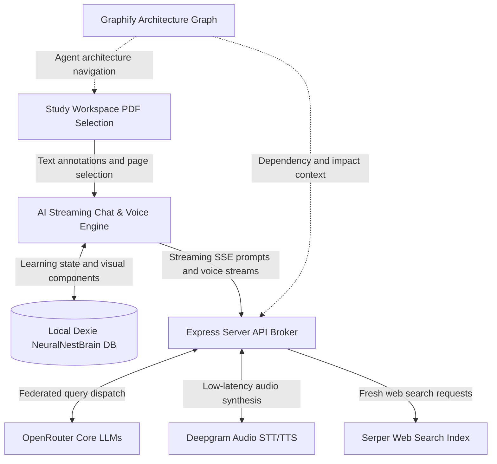

<div align="center">

  <h1>Tutor: Cognitive Learning Interface</h1>

  <p><strong>A high-fidelity learning system powered by source-aware tutoring, real-time audio, local learner memory, and Graphify architecture navigation.</strong></p>

  <picture>
    <source media="(prefers-color-scheme: dark)" srcset="public/banner.png">
    
  </picture>

  <p>
    <a href="https://github.com/MohamedFuad16/Tutor-System-Architecture-/blob/main/LICENSE">
      
    </a>
    <a href="https://react.dev/">
      
    </a>
    <a href="https://www.typescriptlang.org/">
      
    </a>
    <a href="https://openrouter.ai/">
      
    </a>
    <a href="https://deepgram.com/">
      
    </a>
  </p>

  <p align="center">
    <a href="#core-surfaces">Core Surfaces</a> •
    <a href="#system-architecture">System Architecture</a> •
    <a href="#graphify-architecture-layer">Graphify Architecture Layer</a> •
    <a href="#getting-started">Getting Started</a> •
    <a href="#design-system">Design System</a>
  </p>

</div>

---

> [!TIP]
> Tutor is built around a Bring Your Own Key model. Connect your own OpenRouter,
> Deepgram, and Serper keys for streaming tutoring, voice, search, and local
> concept mapping.

## Overview

Tutor is a high-fidelity learning environment for reading papers and textbooks,
asking source-aware tutor questions, building a persistent learning library, and
reviewing knowledge over time. It combines a PDF study surface, streaming AI
chat, voice tutoring, web search, revision notebooks, analytics, admin
diagnostics, built-in architecture/design-language books, and a Graphify-backed
repository architecture graph for maintainers.

## Core Surfaces

Tutor transitions between a dark Cosmic Obsidian study workspace and a clean
paper reading style for revision.

<table width="100%">
  <tr>
    <td width="50%" valign="top">
      <h3>Study Workspace</h3>
      <p>Interactive PDF study surface using <code>react-pdf</code>. Supports text selection, highlights, annotations, and page context extraction.</p>
    </td>
    <td width="50%" valign="top">
      <h3>Streaming Chat Panel</h3>
      <p>SSE tutor responses with custom Markdown, Mermaid diagrams, code rendering, TTS audio, source-material-first search, and smooth reasoning trace UI.</p>
    </td>
  </tr>
  <tr>
    <td width="50%" valign="top">
      <h3>Active Recall Library</h3>
      <p>Paper-style generated learning books, concept notes, active recall cards, and built-in architecture/design-language references.</p>
    </td>
    <td width="50%" valign="top">
      <h3>Three-Dimensional Brain Graph</h3>
      <p>A learner-facing concept matrix that maps books, prerequisites, and concepts into a local knowledge graph.</p>
    </td>
  </tr>
  <tr>
    <td width="50%" valign="top">
      <h3>BKT Analytics Matrix</h3>
      <p>Charts for mastery, confidence, interactions, study sessions, and retention signals.</p>
    </td>
    <td width="50%" valign="top">
      <h3>Admin Diagnostics Console</h3>
      <p>Inspect DeepSeek trace entries and watch live backend logs from the server console.</p>
    </td>
  </tr>
</table>

## System Architecture

Tutor integrates browser-heavy learning surfaces with a local Express proxy for
model, search, document-ingestion, voice, and telemetry routes.

```text
Upload
  -> Document Classifier
     -> Native/Text PDF: PyMuPDF4LLM
     -> Scanned PDF / Images: bounded OCR + vision parsing
     -> Mixed Documents: PyMuPDF4LLM + page-image vision context
```



## Graphify Architecture Layer

Graphify replaces the old custom repository architecture runtime. Architecture
artifacts live in `graphify-out/`.

Useful local commands:

```bash
npm run graphify:query -- "how does chat streaming work?"
npm run graphify:path -- "ChatPanel" "server.ts"
npm run graphify:tree
```

Graph rebuild policy:

- Graphify artifacts are refreshed by `.github/workflows/graphify-refresh.yml`
  only when code is pushed to GitHub.
- The workflow runs `graphify update .`, regenerates `GRAPH_TREE.html`, and
  commits changed `graphify-out` artifacts back with `[skip graphify]`.
- Pull requests run `npm run lint` and `npm run build` without rewriting graph
  artifacts.
- Local agents should use Graphify queries before broad code reads, but should
  not run watch-mode or commit/checkout hooks in this repo.

## Getting Started

### 1. Prerequisites

- Node.js 22 recommended.
- OpenRouter key for chat intelligence.
- Deepgram key for voice and TTS.
- Serper key for live web search.

### 2. Install

```bash
git clone https://github.com/MohamedFuad16/Tutor-System-Architecture-.git
cd Tutor-System-Architecture-
npm install
```

### 3. Configure Environment

Create a `.env` file:

```ini
OPENROUTER_API_KEY=your_openrouter_key_here
DEEPGRAM_API_KEY=your_deepgram_key_here
SERPER_API_KEY=your_serper_key_here
```

### 4. Run

```bash
npm run dev
```

Open `http://localhost:3000`.

## Design System

- Cosmic Obsidian for Study, Graph, Settings, and Admin: ultra-dark surfaces,
  neon violet/blue/orange accents, glass panels, liquid details, and motion.
- Paper Reading Style for Revision and Trace views: `#faf9f6`, serif type, soft
  borders, and quiet reading density.
- App Design Language Library: live wireframes, theme tokens, and interactive
  component previews.

## Contributing

1. Use Graphify graph traversal before broad repository reads.
2. Run `npm run lint` and `npm run build` before opening a pull request.
3. Let GitHub Actions refresh `graphify-out` after code is pushed.

## License

Distributed under the MIT License. See `LICENSE` for details.
