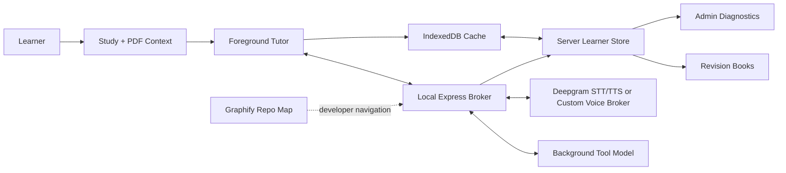

# LearningAI Tutor

LearningAI Tutor is a local-first study workspace for reading PDFs, talking to a source-aware tutor, saving learner memory, and turning useful sessions into revision books. It is built for local beta proof first: the app should teach, remember, explain what it recorded, and show its limits before cloud infrastructure is treated as complete.

## What Is In This Repo

- `Study` renders PDFs, extracted context, annotations, and a book-scoped chat surface.
- `ChatPanel` streams tutor answers, handles tool output, records voice turns, and updates the learner ledger.
- `Revision` renders built-in architecture books and generated learning books with diagrams, code blocks, flashcards, and title-matched stored audio when the checked-in audio manifest matches the current chapter title.
- `Admin` shows the operational view: learner selection, learner-brain graph, evidence, memory, retrieval, voice, tools, model runs, artifacts, corrections, and beta readiness.
- `server.ts` is the local Express broker for chat, voice, web search, TTS, document extraction, learner profiles, learner storage, and diagnostics.
- `Graphify` is the repository architecture graph for maintainers. It is not the learner brain.

## Architecture



The learner brain is now separated from the repository brain and scoped by local profile. Graphify remains the codebase map in `graphify-out/`. Learner data is keyed by `userId` and is stored durably on the local server under `data/users/<userId>/`, with SQLite and per-user document/artifact folders. Browser IndexedDB remains a cache and UI-state layer, not the long-term home for PDF blobs or full extracted text.

IndexedDB is the browser's built-in structured storage system. In this app, Dexie is the helper library that makes IndexedDB easier to query. Think of it as a local browser cache and offline staging area. SQLite is the server-side database file used for durable local learner records. It is a better bridge to future cloud storage because the server can later migrate those rows to Postgres/S3-style infrastructure.

The learner brain records books, documents, concepts, entries, evidence, mastery changes, artifacts, corrections, background jobs, and runtime traces. Mastery is evidence-gated: model summaries can propose learning material, but durable mastery changes require learner evidence linked to concepts.

## Learner Flow

1. The app creates or loads a local profile and sends `X-LearningAI-User-Id` on HTTP requests.
2. The learner opens Study, uploads one or more PDFs, and asks questions by typed chat or voice.
3. PDFs are ingested by the server. Files and extracted text are stored in the active user's local server folder. IndexedDB keeps metadata, previews, and UI state.
4. Chat and voice both build a shared brain context packet from the active user, active book, active PDFs, selected text/current page state, semantic memory, BKT state, and pending work.
5. The foreground tutor answers immediately. Slow work such as source lookup, PDF/tool work, generated artifacts, or code-style tasks is recorded as request-correlated background work.
6. Validated recall evidence, such as an evaluated answer or flashcard review, can update BKT mastery. Transcripts, summaries, tool results, and model observations stay audit-only unless they pass that evidence gate.

## Voice Modes

- `deepgram` mode uses the Deepgram Voice Agent path.
- `custom` mode opens a browser WebSocket to the local broker. The broker sends foreground teaching to an OpenRouter-compatible `VOICE_FOREGROUND_MODEL` and delegates web/code/PDF/tool work to `VOICE_BACKGROUND_MODEL`.
- Background answers are cleaned before insertion so raw markdown such as `**Apple**` is not read aloud.
- MisoTTS is optional and experimental. The local broker only accepts loopback Miso URLs such as `http://127.0.0.1:8080`.
- No route should claim a universal sub-200 ms guarantee. Report latency as measured p50, p95, failure rate, route, provider, region, and hardware.

## Requirements

- Node.js 22
- npm
- Python 3 for document extraction helpers
- Optional provider keys: OpenRouter, Deepgram, Serper

Install local dependencies:

```bash
npm ci
pip install -r requirements.txt
```

Create `.env` from `.env.example` and fill only the providers you need.

## Environment

| Variable                           | Purpose                                                                                                             |
| ---------------------------------- | ------------------------------------------------------------------------------------------------------------------- |
| `OPENROUTER_API_KEY`               | Server-side OpenRouter key for chat and custom voice broker when fallback is enabled.                               |
| `ALLOW_SERVER_OPENROUTER_FALLBACK` | Must be `true` before browser requests may use the server OpenRouter key.                                           |
| `DEEPGRAM_API_KEY`                 | Deepgram STT/TTS key.                                                                                               |
| `ALLOW_SERVER_DEEPGRAM_FALLBACK`   | Must be `true` before browser requests may use the server Deepgram key.                                             |
| `SERPER_API_KEY`                   | Legacy typed-chat web search key. Custom voice background search uses OpenRouter tools instead.                     |
| `VITE_VOICE_BROKER_MODE`           | `deepgram` or `custom`.                                                                                             |
| `VOICE_FOREGROUND_MODEL`           | Fast teaching model, for example `openai/gpt-4o-mini`.                                                              |
| `VOICE_BACKGROUND_MODEL`           | Provider-valid background model id for web/search/code/PDF/tool work. This is not the Codex runtime model selector. |
| `VOICE_BROKER_STT_MODEL`           | Deepgram STT model, default `nova-3`.                                                                               |
| `VOICE_BROKER_TTS_MODEL`           | Deepgram Aura TTS model.                                                                                            |
| `MISO_TTS_API_URL`                 | Optional loopback-only local Miso endpoint.                                                                         |

## Run

```bash
npm run dev
```

If port `3000` is busy:

```bash
npm run dev -- --host 127.0.0.1 --port 3100
```

## Graphify Workflow

Use Graphify before broad code reads:

```bash
graphify query "how does the voice broker connect to ChatPanel?" --budget 2000 --graph graphify-out/graph.json
graphify path "ChatPanel" "server.ts" --graph graphify-out/graph.json
npm run graphify:tree
```

Do not regenerate `graphify-out` automatically after ordinary edits. Refresh Graphify artifacts only when graph maintenance is explicitly requested.

## Architecture Docs

- [System architecture](./TUTOR_ARCHITECTURE.md)
- [Learner brain architecture](./docs/learner-brain-architecture.md)

## Stored Chapter Audio

Checked-in audio guides live under `public/audio-overviews/`. Rewritten built-in chapters only attach stored audio when the manifest chapter title exactly matches the current chapter title, so old MP3s cannot silently play for a new chapter edition. Regenerate audio after chapter-title rewrites:

```bash
npm run audio:overview:dry-run
DEEPGRAM_API_KEY=your_deepgram_key npm run audio:overview:generate -- --provider deepgram --overwrite
```

## Verification

Run the complete local gate before pushing:

```bash
npm run format:check
npm run lint
npm test
npm run build
npm run brain:postchange -- --reason five-agent-release-verification
```

For UI changes, also open the running app in the browser and smoke-test Study, fullscreen chat, Revision, and Admin at desktop and mobile widths.

## Current Local-Beta Boundaries

- Local profiles provide stable user IDs, but they are not real cloud authentication.
- Durable local learner records live in server folders and SQLite. Production tenancy, backups, retention, and organization administration are deferred.
- IndexedDB is still used for local cache/UI state and non-destructive migration fallback, but it should not be treated as the durable source for full PDFs or full extracted text.
- Voice provider combinations need measured real-key proof before any latency promise is made.
- Citation and artifact checks record provenance and local consistency; they do not prove every generated claim is factually true.
- AWS deployment is intentionally deferred until local beta behavior is repeatable and inspectable.

## License

MIT.
