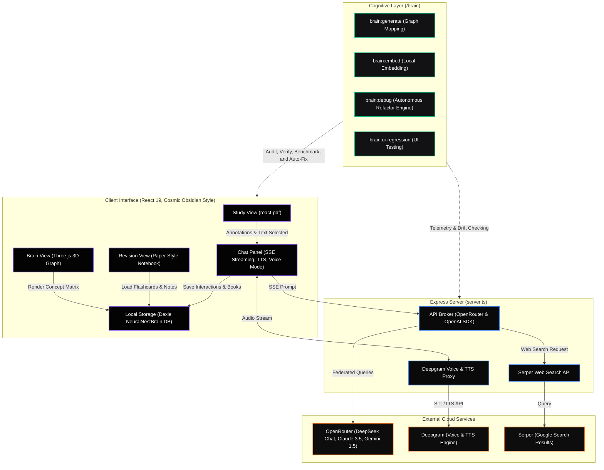

<div align="center">
  
  <!-- Adaptive Theme-Aware Banner -->
  <picture>
    <source media="(prefers-color-scheme: dark)" srcset="public/banner.png">
    
  </picture>

  <h1>🌌 Tutor: Cognitive Learning Interface</h1>
  
  <p><strong>A hyper-advanced, type-safe learning system powered by agentic retrieval, real-time audio tutoring, and autonomous `/brain` self-healing cognition.</strong></p>

  <!-- Branded Neon Color-Coordinated Badges -->
  <p>
    <a href="https://github.com/MohamedFuad16/Tutor-System-Architecture-/blob/main/LICENSE">
      
    </a>
    <a href="https://react.dev/">
      
    </a>
    <a href="https://www.typescriptlang.org/">
      
    </a>
    <a href="https://openrouter.ai/">
      
    </a>
    <a href="https://deepgram.com/">
      
    </a>
  </p>
  
  <p align="center">
    <a href="#-core-surfaces">Core Surfaces</a> •
    <a href="#%EF%B8%8F-system-architecture">System Architecture</a> •
    <a href="#-cognitive-autonomy-layer-brain">Cognitive Autonomy Layer</a> •
    <a href="#-getting-started">Getting Started</a> •
    <a href="#-design-system">Design System</a>
  </p>
  
</div>

---

> [!TIP]
> **Experience the Cosmic Obsidian DX:** Tutor is engineered under a strict **Bring Your Own Key (BYOK)** model. Connect your personal APIs and experience ultra-low latency SSE chat, instant text-to-speech, and deep local concept mapping right in your browser.

---

## 📖 Overview

**Tutor** is not just a PDF reader—it is an intelligent, high-fidelity learning environment that builds a persistent structural memory of your academic study progress. By synthesizing a 3D learner model, real-time streaming tutor agents, automated book-scoped flashcards, local browser databases, and dynamic search, Tutor turns passive reading material into an active, multi-sensory masterclass.

It features a custom-built **`/brain` Cognitive Autonomy Layer** that monitors local codebase health, calculates code dependencies, runs runtime performance benchmarks, and employs long-horizon AI self-healing agents to automatically audit and patch system bugs.

---

## 🎨 Core Surfaces & Bento Grid

Tutor transitions seamlessly between a dark-mode **Cosmic Obsidian** control panel for live studying, and a clean **Paper Reading Style** for deep-focus revision reviews.

<table width="100%">
  <tr>
    <td width="50%" valign="top">
      <h3>📁 Study Workspace</h3>
      <p>Interactive PDF study surface using <code>react-pdf</code>. Supports rich-text selection, sticky highlights, annotations, and active page extraction. Page images are sent directly to multi-modal vision layers (Qwen-VL / GPT-4o-Mini) to extract titles and diagram contexts.</p>
    </td>
    <td width="50%" valign="top">
      <h3>💬 Streaming Chat Panel</h3>
      <p>Streaming SSE tutor response window loaded with custom Markdown, native <strong>Mermaid diagrams</strong>, runnable JS/Python sandboxes, TTS audio, and real-time Google search via Serper. Includes an animated step-by-step reasoning trace with precise cost/token telemetry.</p>
    </td>
  </tr>
  <tr>
    <td width="50%" valign="top">
      <h3>📚 Active Recall Library</h3>
      <p>A classic paper-style textbook interface. Houses generated learning books, custom-mapped concept graphs, personal notes, and revision flashcards stored locally. Modeled after textbook layouts to minimize cognitive overload.</p>
    </td>
    <td width="50%" valign="top">
      <h3>🧠 Three-Dimensional Brain</h3>
      <p>An interactive, hardware-accelerated 3D concept matrix rendered using Three.js and <code>react-force-graph-3d</code>. Maps out the learner's knowledge nodes, linking books, prerequisites, and concepts together dynamically.</p>
    </td>
  </tr>
  <tr>
    <td width="50%" valign="top">
      <h3>📊 BKT Analytics</h3>
      <p>Dynamic charts tracking concept mastery and session metrics powered by Recharts. Operates on a local <strong>Bayesian Knowledge Tracing (BKT)</strong> engine to calculate knowledge retention, scaffolding levels, and illusion-of-knowing alerts.</p>
    </td>
    <td width="50%" valign="top">
      <h3>🛡️ Admin Diagnostics</h3>
      <p>A master telemetry room. Inspect deep LLM trace chains, watch active WebSocket server logs, and monitor long-horizon <code>brain:debug</code> refactoring tasks as they execute across targets.</p>
    </td>
  </tr>
</table>

---

## ⚙️ System Architecture

Tutor integrates heavy-performance browser surfaces with an agile local server proxy to coordinate high-speed streaming, voice synthesizers, and database mutations:



---

## 🤖 Cognitive Autonomy Layer (`/brain`)

The `/brain` folder represents the cognitive core of Tutor's development architecture. It is designed to allow coding agents and local environments to maintain high system cohesion, prevent architectural drift, and automatically fix bugs.

> [!IMPORTANT]
> When executing codebase refactoring or feature additions, you **must** follow the agentic cycle:
> `LOAD` ➔ `RETRIEVE` ➔ `IMPACT ANALYSIS` ➔ `VERIFY RULES` ➔ `PLAN` ➔ `MODIFY` ➔ `VERIFY` ➔ `REGENERATE` ➔ `UPDATE MEMORY`

### Core Development Commands

| Command | Action / Operational Purpose |
| :--- | :--- |
| `npm run brain:generate` | Scans the codebase and regenerates the dependency, graph, and API maps. |
| `npm run brain:embed` | Updates the semantic retrieval index using local Xenova embeddings. |
| `npm run brain:verify` | Audits the codebase against mutation boundaries and structural architecture rules. |
| `npm run brain:drift-check` | Assesses codebase files to detect any non-compliant structural or layout deviations. |
| `npm run brain:runtime-benchmark` | Profiles app rendering performance and logs microsecond telemetry. |
| `npm run brain:postchange` | Executed after every code change to automatically regenerate maps, verify rules, and update cache. |
| `npm run brain:debug -- --mode fix --scope all` | Invokes the long-horizon autonomous debugger to analyze, benchmark, and patch targets. |

---

## 🚀 Getting Started

### 1. Prerequisites
* **Node.js** (v18+ recommended)
* A valid set of API keys (BYOK Model):
  - **OpenRouter Key:** To power chat intelligence models (`deepseek-chat`, `claude-3.5-sonnet`, `gemini-1.5-pro`)
  - **Deepgram Key:** To broker low-latency voice, text-to-speech, and transcriptions
  - **Serper Key:** To fetch real-time web news and search indexes

### 2. Quickstart Installation

```bash
# Clone the repository
git clone https://github.com/MohamedFuad16/Tutor-System-Architecture-.git
cd Tutor-System-Architecture-

# Install dependencies
npm install
```

### 3. Environment Variables Configuration

Create a `.env` file in the root directory:

```ini
# Core LLM API Provider Key
OPENROUTER_API_KEY=your_openrouter_key_here

# Audio, Voice & TTS Engine Provider Key
DEEPGRAM_API_KEY=your_deepgram_key_here

# Live Google Search Index Key
WEB_SEARCH_API_KEY=your_web_search_key_here
```

### 4. Running the Application

Start the integrated client and backend proxy servers concurrently:

```bash
npm run dev
```

Navigate to `http://localhost:5173` to start learning!

---

## 🎨 Design System

The application combines two contrasting high-impact themes, carefully selected to balance active system diagnostics with deep reading focus:

* **Cosmic Obsidian Theme (Study, Graph, Settings, Admin views):**
  - **Primary Backgrounds:** Ultra-dark obsidian `#030303` and glass-obsidian panel `#0A0A0B`.
  - **Accents:** Neon Violet (`#8B5CF6`), Neon Blue (`#3B82F6`), and Neon Orange (`#F97316`) glow borders and motion transitions.
  - **Details:** Transparent layouts, liquid progress indicators, and custom glowing focus rings.
* **Paper Reading Theme (Revision & Trace views):**
  - **Primary Background:** `#faf9f6` paper texture.
  - **Typography:** Serif fonts styled like high-quality printed textbooks and notes.
  - **Details:** Soft shadows, minimal high-contrast dividers, and warm-toned review markers.

---

## 🤝 Contributing

Contributions are highly welcome! Please follow these guidelines:
1. Ensure all changes are verified using `npm run brain:verify`.
2. Run `npm run brain:postchange` to sync cognitive dependency maps before creating a pull request.
3. Review `TUTOR_ARCHITECTURE.md` to understand high-risk mutation boundaries before modifying Dexie database structures.

---

## 📄 License

Distributed under the **MIT License**. See `LICENSE` for details.
