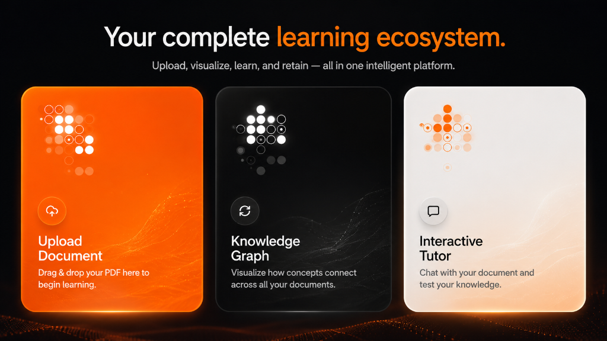
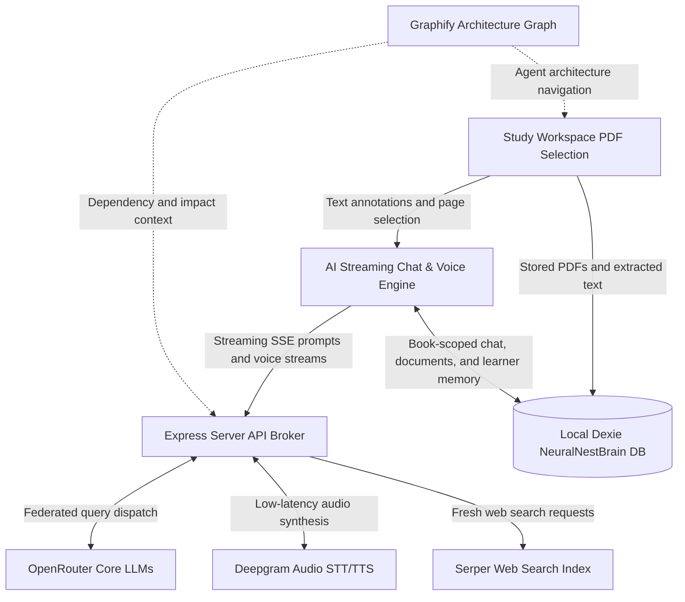

<div align="center">

  <h1>Tutor: Cognitive Learning Interface</h1>

  <p><strong>A high-fidelity learning system powered by source-aware tutoring, real-time audio, local learner memory, and Graphify architecture navigation.</strong></p>

  <picture>
    <source media="(prefers-color-scheme: dark)" srcset="public/banner.png">
    
  </picture>

  <p>
    <a href="https://github.com/MohamedFuad16/Tutor-System-Architecture-/blob/main/LICENSE">
      
    </a>
    <a href="https://react.dev/">
      
    </a>
    <a href="https://www.typescriptlang.org/">
      
    </a>
    <a href="https://openrouter.ai/">
      
    </a>
    <a href="https://deepgram.com/">
      
    </a>
  </p>

  <p align="center">
    <a href="#core-surfaces">Core Surfaces</a> •
    <a href="#system-architecture">System Architecture</a> •
    <a href="#graphify-architecture-layer">Graphify Architecture Layer</a> •
    <a href="#getting-started">Getting Started</a> •
    <a href="#design-system">Design System</a>
  </p>

</div>

---

> [!TIP]
> Tutor is built around a Bring Your Own Key model. Connect your own OpenRouter,
> Deepgram, and Serper keys for streaming tutoring, voice, search, and local
> concept mapping.

## Overview

Tutor is a high-fidelity learning environment for reading papers and textbooks,
asking source-aware tutor questions, building a persistent learning library, and
reviewing knowledge over time. It combines a PDF study surface, streaming AI
chat, voice tutoring, web search, revision notebooks, analytics, admin
diagnostics, built-in architecture/design-language books, and a Graphify-backed
repository architecture graph for maintainers.

The Study, Chat, and Revision surfaces share one book-scoped context model. Each
learning book owns exactly one durable chat thread, one active PDF selection, and
any number of stored PDF documents. Switching books switches the visible chat,
document rail, injected memory context, and revision notebook together.
Typed chat and live voice sessions also share request-level observability:
browser-generated request ids connect the shared brain-context packet, memory
retrieval, server activity, model runs, and tool jobs in Admin.
Admin Beta Diagnostics now includes a local brain-flow coverage verifier that
checks whether chat context injection, voice context injection, request
correlation, foreground tool calls, and background learner-memory writes all
have durable local evidence before broader beta claims.

## Core Surfaces

Tutor transitions between a dark Cosmic Obsidian study workspace and a clean
paper reading style for revision.

<table width="100%">
  <tr>
    <td width="50%" valign="top">
      <h3>Study Workspace</h3>
      <p>Interactive multi-PDF study surface using <code>react-pdf</code>. Each learning book can store multiple PDFs, switch between them, preserve viewed pages, and feed extracted document context into chat.</p>
    </td>
    <td width="50%" valign="top">
      <h3>Streaming Chat Panel</h3>
      <p>SSE tutor responses with custom Markdown, Mermaid diagrams, code rendering, TTS audio, source-material-first search, and one persistent conversation thread per learning book.</p>
    </td>
  </tr>
  <tr>
    <td width="50%" valign="top">
      <h3>Active Recall Library</h3>
      <p>Paper-style generated learning books, concept notes, active recall cards, and built-in architecture/design-language references.</p>
    </td>
    <td width="50%" valign="top">
      <h3>Three-Dimensional Brain Graph</h3>
      <p>A learner-facing concept matrix that maps books, prerequisites, and concepts into a local knowledge graph.</p>
    </td>
  </tr>
  <tr>
    <td width="50%" valign="top">
      <h3>BKT Analytics Matrix</h3>
      <p>Charts for mastery, confidence, interactions, study sessions, and retention signals.</p>
    </td>
    <td width="50%" valign="top">
      <h3>Admin Diagnostics Console</h3>
      <p>Inspect request timelines, model runs, tool jobs, memory/retrieval injections, voice events, DeepSeek trace entries, and live backend logs from the server console.</p>
    </td>
  </tr>
</table>

## System Architecture

Tutor integrates browser-heavy learning surfaces with a local Express proxy for
model, search, document-ingestion, voice, and telemetry routes.

```text
Upload
  -> Document Classifier
     -> Native/Text PDF: PyMuPDF4LLM
     -> Scanned PDF / Images: bounded OCR + vision parsing
     -> Mixed Documents: PyMuPDF4LLM + page-image vision context
```



## Book-Scoped Study Workflow

Tutor treats a learning book as the durable unit of context:

- `General Study` has its own persistent chat thread.
- Every generated or saved learning book has exactly one persistent chat thread.
- Switching books in Chat or opening a generated book in Revision updates the
  shared active book ID.
- The chat transcript, active PDF, selected document context, flashcards, and
  learning entries stay scoped to that book.
- Refresh restores the last active book, then reloads that book's chat thread
  and active PDF from local Dexie/IndexedDB state.

This avoids cross-book leakage. A Python book loads the Python conversation and
document context; General Study loads only the General Study conversation and
context.

## Multi-PDF Books

Study books can now hold more than one PDF:

1. Select or create the book context in Chat or Revision.
2. Add PDFs from Study. Each PDF is saved as a `learningDocuments` record linked
   to the active book.
3. The document rail lets you switch between PDFs without replacing the book.
4. Removing a PDF deletes that document record and its document-scoped
   annotations without deleting the learning book notes.
5. The active book's ready document extracts are injected alongside memory and
   book summaries when Chat builds a tutor request.
6. Each chat request builds a shared brain-context packet from memory, active
   book, document, and interaction state, then carries the browser request id
   through memory retrieval, `/api/chat`, model/tool ledgers, and Admin request
   timelines. Voice uses the voice session id for the same local packet and
   correlation path.
7. Voice can call the local `look_at_current_page` bridge for current-page,
   visible-diagram, screen, and source-material questions from the rendered PDF
   canvas.
8. Voice can call the local `web_search` bridge for explicit web or freshness
   questions, with Admin recording the voice tool status and source cards.

PDF blobs, extracted text, active document ID, page position, and zoom are stored
locally in the browser. Large scanned documents may still be bounded by browser
storage quota and the server-side document extraction limits.

## Graphify Architecture Layer

Graphify replaces the old custom repository architecture runtime. Architecture
artifacts live in `graphify-out/`.

Useful local commands:

```bash
npm run graphify:query -- "how does chat streaming work?"
npm run graphify:path -- "ChatPanel" "server.ts"
npm run graphify:tree
```

Graph rebuild policy:

- Graphify artifacts are refreshed only by explicit local or agent-requested
  maintenance; there is no GitHub Actions graph refresh on push or pull request.
- When Graphify maintenance is requested, run `graphify update .` and
  `npm run graphify:tree`, then commit the changed `graphify-out` artifacts.
- Run `npm run lint` and `npm run build` locally before pushing or opening pull
  requests.
- Local agents should use Graphify queries before broad code reads, but should
  not run watch-mode or commit/checkout hooks in this repo.

## Getting Started

### 1. Prerequisites

- Node.js 22 recommended.
- OpenRouter key for chat intelligence. Each user can bring their own key in
  Settings; a deployment-wide OpenRouter key is optional and must be explicitly
  enabled as a shared fallback.
- Deepgram key for voice, TTS, and stored built-in chapter audio generation.
- Serper key for live web search.

### 2. Install

```bash
git clone https://github.com/MohamedFuad16/Tutor-System-Architecture-.git
cd Tutor-System-Architecture-
npm install
```

### 3. Configure Environment

Create a `.env` file:

```ini
OPENROUTER_API_KEY=your_openrouter_key_here
ALLOW_SERVER_OPENROUTER_FALLBACK=false
DEEPGRAM_API_KEY=your_deepgram_key_here
SERPER_API_KEY=your_serper_key_here
```

Leave `ALLOW_SERVER_OPENROUTER_FALLBACK=false` when users should provide their
own OpenRouter keys. Set it to `true` only for deployments where the owner
intentionally pays for unauthenticated chat fallback.

### 4. Run

```bash
npm run dev
```

### 5. Generate Stored Chapter Audio

Built-in Library books use checked-in 3-4 minute MP3 assets for every chapter
guide, so playback is local and does not call the live read-aloud route.

```bash
npm run audio:overview:dry-run
DEEPGRAM_API_KEY=your_deepgram_key npm run audio:overview:generate -- --provider deepgram --overwrite
```

The default generator uses Deepgram `aura-2-odysseus-en` at speed `1` and exits
before network synthesis if `DEEPGRAM_API_KEY` is missing. The generated MP3s
are saved under `public/audio-overviews/` and played directly by the browser.

Open `http://localhost:3000`.

## Design System

- Cosmic Obsidian for Study, Graph, Settings, and Admin: ultra-dark surfaces,
  neon violet/blue/orange accents, glass panels, liquid details, and motion.
- Paper Reading Style for Revision and Trace views: `#faf9f6`, serif type, soft
  borders, and quiet reading density.
- App Design Language Library: live wireframes, theme tokens, and interactive
  component previews.

## Contributing

1. Use Graphify graph traversal before broad repository reads.
2. Run `npm run lint` and `npm run build` before opening a pull request.
3. Refresh `graphify-out` only when Graphify maintenance is explicitly in scope.

## License

Distributed under the MIT License. See `LICENSE` for details.
