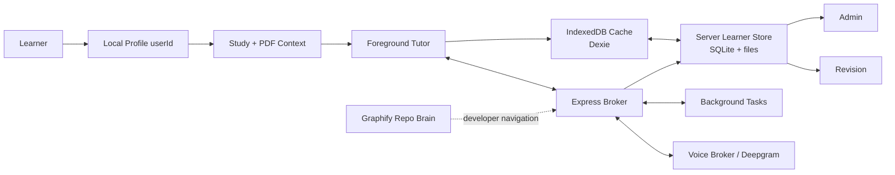

<div align="center">

  <h1>Tutor: Cognitive Learning Interface</h1>

  <p><strong>A local-first learning system for PDFs, source-aware tutoring, voice mode, learner memory, revision, and inspectable AI workflows.</strong></p>

  <picture>
    <source media="(prefers-color-scheme: dark)" srcset="public/banner.png">
    
  </picture>

  <p>
    <a href="https://github.com/MohamedFuad16/Tutor-System/blob/main/LICENSE">
      
    </a>
    <a href="https://react.dev/">
      
    </a>
    <a href="https://www.typescriptlang.org/">
      
    </a>
    <a href="https://vite.dev/">
      
    </a>
    <a href="https://tailwindcss.com/">
      
    </a>
  </p>

  <p>
    <a href="#overview">Overview</a> -
    <a href="#technology-stack">Technology Stack</a> -
    <a href="#core-surfaces">Core Surfaces</a> -
    <a href="#architecture">Architecture</a> -
    <a href="#getting-started">Getting Started</a> -
    <a href="#license">License</a>
  </p>

</div>

---

> [!TIP]
> Tutor supports browser BYOK for local development and explicit server-side
> OpenRouter/Deepgram fallbacks for trusted deployments. Shared server keys stay
> disabled until their matching `ALLOW_SERVER_*_FALLBACK` flag is enabled.

## Overview

Tutor is a local-first study workspace for reading papers and textbooks,
asking a source-aware tutor questions, speaking with a realtime voice tutor, and
turning useful sessions into revision books.

The app is built around one clear product loop:

1. Open a local learner profile.
2. Upload one or more PDFs into a learning book.
3. Ask questions by typed chat or voice.
4. Build a user-scoped context packet from PDFs, selected text, current page,
   prior discussion, semantic memory, and learner state.
5. Answer immediately in the foreground tutor.
6. Delegate slow work to request-correlated background tasks.
7. Store evidence, artifacts, corrections, and revision material for the active
   learner.

The learner brain is not hidden model memory. It is an auditable local system of
records: books, PDFs, concepts, evidence, BKT mastery, artifacts, corrections,
model runs, retrievals, and background jobs. Graphify is separate: it is the
repository architecture graph for developers and agents.

## Technology Stack

| Layer              | Technologies                                                               |
| ------------------ | -------------------------------------------------------------------------- |
| Frontend           | React 19, TypeScript 5.8, Vite 6, Tailwind CSS 4                           |
| State              | Zustand for app state, Dexie over IndexedDB for browser cache/offline rows |
| PDF and documents  | `react-pdf`, PDF.js worker, Python extraction helpers, PyMuPDF4LLM flow    |
| Rich output        | React Markdown, Mermaid, Shiki, KaTeX, Recharts                            |
| Backend            | Node.js, Express, Server-Sent Events, WebSocket routes                     |
| Learner store      | Per-user local folders, SQLite, document/extracted-text/artifact files     |
| AI routes          | OpenRouter-compatible chat/vision routes, tool contracts, background jobs  |
| Voice              | Deepgram STT/TTS, custom local broker, optional MisoTTS read-aloud path    |
| Search             | Serper for explicit web/freshness requests                                 |
| Architecture graph | Graphify artifacts in `graphify-out/`                                      |

<p>
  
  
  
  
  
  
</p>

## Core Surfaces

<table width="100%">
  <tr>
    <td width="50%" valign="top">
      <h3>Study Workspace</h3>
      <p>Interactive multi-PDF study surface using <code>react-pdf</code>. Desktop keeps the reader and tutor side by side; mobile opens chat first and treats PDFs as attached context until the learner chooses to view the page.</p>
    </td>
    <td width="50%" valign="top">
      <h3>Streaming Chat Panel</h3>
      <p>SSE tutor responses with Markdown, Mermaid diagrams, code rendering, TTS read-aloud, source-aware prompt context, and one persistent conversation thread per learning book.</p>
    </td>
  </tr>
  <tr>
    <td width="50%" valign="top">
      <h3>Voice Mode</h3>
      <p>Deepgram or custom local broker voice sessions. The foreground tutor keeps the conversation moving while slow work is delegated into background tasks.</p>
    </td>
    <td width="50%" valign="top">
      <h3>Learner Brain</h3>
      <p>User-scoped memory for books, PDFs, concepts, semantic context, BKT evidence, mastery deltas, artifacts, and corrections.</p>
    </td>
  </tr>
  <tr>
    <td width="50%" valign="top">
      <h3>Revision Library</h3>
      <p>Paper-style generated learning books, built-in architecture books, active recall, flashcards, code blocks, diagrams, and title-matched stored audio guides.</p>
    </td>
    <td width="50%" valign="top">
      <h3>Admin Diagnostics</h3>
      <p>Inspect request timelines, model runs, tool jobs, memory/retrieval injections, voice events, evidence rows, artifacts, corrections, and readiness checks.</p>
    </td>
  </tr>
</table>

## Architecture



The learner brain is scoped by `userId`. Durable learner data lives under:

```text
data/users/<userId>/
  brain.sqlite
  documents/
  extracted-text/
  artifacts/
  exports/
```

IndexedDB is the browser's built-in structured storage system. Tutor uses Dexie
to work with it. In this repo, IndexedDB is a cache and UI-state layer: metadata,
small previews, active document state, and non-destructive migration fallback.
It is not the durable owner of full PDFs or full extracted text.

SQLite is the local server database file for durable learner rows. The app keeps
`user_id` on rows even inside each per-user database so the same shape can move
to cloud Postgres/object storage later.

## Learner Brain Rules

- Local profiles provide stable user IDs; they are not production cloud auth.
- Chat and voice share `src/memory/brain.context.ts` for user-scoped context
  packets.
- PDF files and extracted text are stored server-side; browser rows keep cache
  metadata and previews.
- Model summaries, transcripts, tool results, and artifacts are teaching/audit
  context only.
- BKT mastery changes require validated evidence such as evaluated answers or
  flashcard reviews linked to real concepts.
- Background tasks are request-correlated so Admin can follow one user action
  across chat, voice, tools, retrieval, artifacts, and memory writes.

## Voice Modes

- `deepgram` mode uses the Deepgram Voice Agent path.
- `custom` mode opens a browser WebSocket to the local broker. The broker sends
  foreground teaching to an OpenRouter-compatible `VOICE_FOREGROUND_MODEL` and
  delegates web/code/PDF/tool work to `VOICE_BACKGROUND_MODEL`.
- Background answers are cleaned before insertion so raw markdown such as
  `**Apple**` is not read aloud.
- MisoTTS is optional and experimental. The local broker only accepts loopback
  Miso URLs such as `http://127.0.0.1:8080`.
- No route should claim a universal sub-200 ms guarantee. Report latency as
  measured p50, p95, failure rate, route, provider, region, and hardware.

## Getting Started

Requirements:

- Node.js 22
- npm
- Python 3 for document extraction helpers
- Optional provider keys: OpenRouter, Deepgram, Serper

Install dependencies:

```bash
npm ci
pip install -r requirements.txt
```

Create `.env` from `.env.example` and fill only the providers you need.

Run locally:

```bash
npm run dev
```

If port `3000` is busy:

```bash
npm run dev -- --host 127.0.0.1 --port 3100
```

## Environment

| Variable                           | Purpose                                                                                         |
| ---------------------------------- | ----------------------------------------------------------------------------------------------- |
| `OPENROUTER_API_KEY`               | Server-side OpenRouter key for chat and custom voice broker when fallback is enabled.           |
| `ALLOW_SERVER_OPENROUTER_FALLBACK` | Must be `true` before browser requests may use the server OpenRouter key.                       |
| `DEEPGRAM_API_KEY`                 | Deepgram STT/TTS key.                                                                           |
| `ALLOW_SERVER_DEEPGRAM_FALLBACK`   | Must be `true` before browser requests may use the server Deepgram key.                         |
| `SERPER_API_KEY`                   | Legacy typed-chat web search key. Custom voice background search uses OpenRouter tools instead. |
| `VITE_VOICE_BROKER_MODE`           | `deepgram` or `custom`.                                                                         |
| `VOICE_FOREGROUND_MODEL`           | Fast teaching model, for example `openai/gpt-4o-mini`.                                          |
| `VOICE_BACKGROUND_MODEL`           | Provider-valid background model id for web/search/code/PDF/tool work.                           |
| `VOICE_BROKER_STT_MODEL`           | Deepgram STT model, default `nova-3`.                                                           |
| `VOICE_BROKER_TTS_MODEL`           | Deepgram Aura TTS model.                                                                        |
| `MISO_TTS_API_URL`                 | Optional loopback-only local Miso endpoint.                                                     |

## Architecture Docs

- [System architecture](./TUTOR_ARCHITECTURE.md)
- [Learner brain architecture](./docs/learner-brain-architecture.md)
- [Agent workflow instructions](./AGENTS.md)

## Graphify Workflow

Use Graphify before broad code reads:

```bash
graphify query "how does the voice broker connect to ChatPanel?" --budget 2000 --graph graphify-out/graph.json
graphify path "ChatPanel" "server.ts" --graph graphify-out/graph.json
npm run graphify:tree
```

Do not regenerate `graphify-out` automatically after ordinary edits. Refresh
Graphify artifacts only when graph maintenance is explicitly requested.

## Verification

Run the complete local gate before pushing:

```bash
npm run format:check
npm run lint
npm test
npm run build
npm run brain:postchange -- --reason readme-update
```

For UI changes, also open the running app in the browser and smoke-test Study,
fullscreen chat, Revision, and Admin at desktop and mobile widths.

## Local-Beta Boundaries

- Local profiles provide stable user IDs, but they are not real cloud
  authentication.
- Durable local learner records live in server folders and SQLite. Production
  tenancy, backups, retention, and organization administration are deferred.
- IndexedDB is still used for local cache/UI state and non-destructive migration
  fallback, but it should not be treated as the durable source for full PDFs or
  full extracted text.
- Voice provider combinations need measured real-key proof before any latency
  promise is made.
- Citation and artifact checks record provenance and local consistency; they do
  not prove every generated claim is factually true.

## License

This project is licensed under the [MIT License](./LICENSE).
