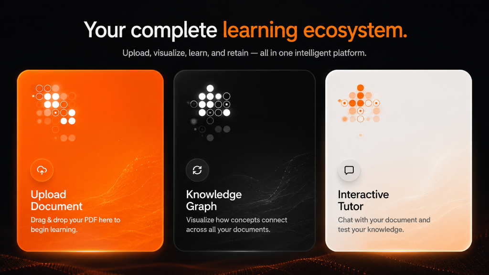
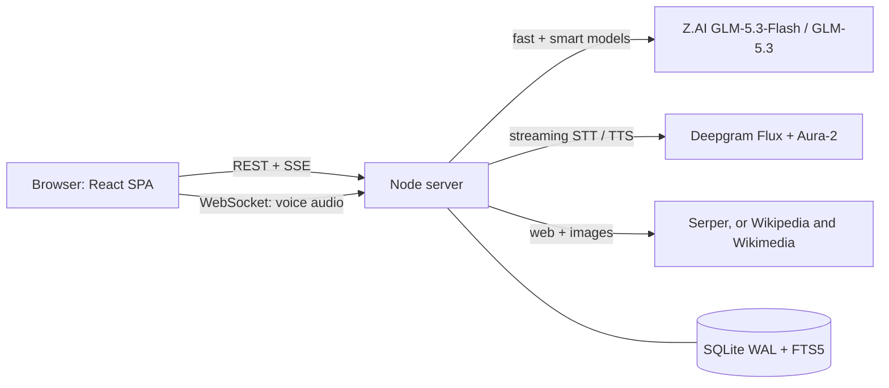

<div align="center">

  <h1>Tutor</h1>

  <p><strong>Bring a document. Ask by typing or talking. Watch it get explained, drawn and turned into a living study guide.</strong></p>

  

  <p>
    
    
    
    
    
    
  </p>

</div>

---

## What it does

1. **Upload a PDF** into a notebook. Tutor reads every page (with OCR for
   scanned pages) and indexes it for retrieval. English and Japanese/CJK both
   work.
2. **Ask questions** by typing or with voice. Answers are grounded in your
   document, and every claim cites its page as a clickable chip that jumps the
   reader there.
3. **See it.** Processes become compact **Mermaid diagrams that draw
   themselves in** and fit the chat. "Walk me through" narrates each node
   aloud while it is highlighted. Real photos appear when a picture helps,
   dissolving in from a soft pixel mosaic.
4. **Talk it through.** Voice mode is a duplex "fast talker, slow thinker":
   - GLM-5.3-Flash keeps the conversation flowing.
   - GLM-5.3 works on diagrams and deep answers in the background, then
     presents them with a narrated tour.
   - You can interrupt at any time.
   - A real-time **liquid glass orb** (WebGPU, six presets) rests while you
     talk, blooms when the tutor thinks or speaks, and moves with the live
     audio.
     Typed answers stream at an even, word-by-word pace, introduced by the
     tutor's animated avatar and a small orb that names what it is doing.
5. **Learn for real.**
   - The tutor checks understanding with quiz cards, which are graded on the
     server.
   - Mastery per concept follows Bayesian Knowledge Tracing.
   - Flashcards are scheduled with SM-2.
   - Explanations adapt to your level.
6. **Revise from a living study guide** that writes itself in the background
   from every conversation. It has a concept map (glass orbs coloured by
   mastery), key points, diagrams, worked examples, common traps, a glossary
   and flip-card self-checks.
7. **Track progress** in Analytics: study time, activity, mastery
   distribution, quiz accuracy, and concepts due for review.

## Architecture at a glance


```mermaid
flowchart LR
  B["Browser: React SPA"] -- "REST + SSE" --> S["Node server"]
  B -- "WebSocket: voice audio" --> S
  S -- "fast + smart models" --> Z["Z.AI GLM-5.3-Flash / GLM-5.3"]
  S -- "streaming STT / TTS" --> D["Deepgram Flux + Aura-2"]
  S -- "web + images" --> W["Serper, or Wikipedia and Wikimedia"]
  S --- DB[("SQLite WAL + FTS5")]
```

- **One lean Node process** serves the SPA, the API and voice. There is no
  Python and no separate voice server.
- **Priority queues per model.** Live voice beats typed chat, which beats
  background work. Throttling (429 or Z.AI error 1302) halves concurrency
  automatically, and it recovers as requests succeed.
- **One source of truth.** SQLite on the server; the browser keeps only
  preferences.
- **Mock providers** make everything runnable and testable offline.

The full design, including data model, latency budget, security and the AWS
deployment path, is in **[docs/ARCHITECTURE.md](docs/ARCHITECTURE.md)**.

## Quick start

Requirements: Node.js 20.19+ (22 recommended).

```bash
npm install
cp .env.example .env      # add ZAI_API_KEY; DEEPGRAM_API_KEY and SERPER_API_KEY are optional
npm run dev               # http://localhost:3000 (API, SPA with HMR, voice WebSocket)
```

With no keys at all, Tutor runs on an offline mock model and browser speech,
so you can build UI without spending tokens.

### Keys and what they unlock

| Variable           | Unlocks                                                                | Without it                            |
| ------------------ | ---------------------------------------------------------------------- | ------------------------------------- |
| `ZAI_API_KEY`      | Real tutoring, study guides, OCR, quiz grading                         | Offline mock model                    |
| `DEEPGRAM_API_KEY` | Low-latency streaming voice (Flux STT, Aura-2 TTS), natural read-aloud | Browser speech recognition and voices |
| `SERPER_API_KEY`   | Google web + image search                                              | Wikipedia + Wikimedia Commons (free)  |

> **Z.AI plans.** The default endpoint is pay-as-you-go
> (`https://api.z.ai/api/paas/v4`). The GLM **Coding Plan** endpoint
> (`/api/coding/paas/v4`) only accepts Coding Plan keys, and Z.AI's plan
> terms limit those keys to supported coding tools. Use a pay-as-you-go key
> for this app.

All other settings (models, concurrency, voice thresholds, limits) are
documented in [`.env.example`](.env.example).

## Scripts

| Command                              | What it does                                                                  |
| ------------------------------------ | ----------------------------------------------------------------------------- |
| `npm run dev`                        | Dev server with Vite HMR and server reload                                    |
| `npm run build`                      | SPA → `dist/client`, server bundle → `dist/server.mjs`                        |
| `npm start`                          | Run the production build                                                      |
| `npm run lint` / `npm run typecheck` | Strict TypeScript for web and server                                          |
| `npm test`                           | Unit, provider, full HTTP + WebSocket integration and component tests         |
| `npm run test:e2e`                   | Browser walkthrough of every screen (needs a running server; uses Playwright) |
| `npm run format`                     | Prettier                                                                      |

## Deploying

```bash
docker build -t tutor .
docker run -p 3000:3000 -v tutor-data:/data --env-file .env tutor
```

- The image runs as non-root, has a health check, and shuts down gracefully
  (voice sessions drain on `SIGTERM`).
- Voice needs a host that keeps WebSockets open: ECS/Fargate or EC2 behind an
  ALB, Fly.io, Render and similar all work. Serverless platforms such as
  Vercel functions do not.
- The SPA can still be served from a CDN; set `VITE_API_BASE` and
  `ALLOWED_ORIGINS`.
- [docs/ARCHITECTURE.md §8](docs/ARCHITECTURE.md) covers the phase-1 single
  instance and the phase-2 scale-out (RDS Postgres, S3, Redis, SQS).

## Project layout

```
shared/     contracts shared by server and web (types, voice protocol, study-guide schema, speech normalisation)
server/     Express + WebSocket server: providers, store, services, voice, http
web/        React app (Vite root): app shell, features/{study,chat,voice,revision,analytics}, components, lib
test/       vitest suites (server, shared, web) and the Playwright smoke walkthrough
docs/       architecture
```

> The v1 sources (`src/`, `server.ts`, `api/`, `scripts/`, `tests/`) are no
> longer referenced by the build and are scheduled for removal.

## License

[MIT](./LICENSE) · Built by <a href="https://github.com/MohamedFuad16">Mohamed Fuad</a> · <a href="https://www.mohamedfuad.com">mohamedfuad.com</a>
