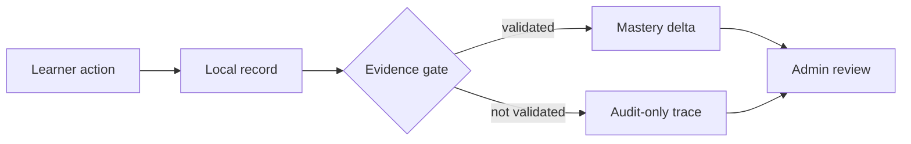

# Tutor System Architecture

This is the short, source-facing architecture guide for Tutor. It explains what
the app owns, what the learner brain means, what Admin can prove, and which
claims are still local-beta only. The repository code graph is Graphify and
lives in `graphify-out/`; it is separate from the learner brain shown in the
product.

For a plain-English learner-memory walkthrough, see
`docs/learner-brain-architecture.md`.

## 1. Product Shape

Tutor helps a learner read PDFs, ask a source-aware tutor questions, speak with
a realtime voice tutor, save useful learning material, and review it later. The
main product surfaces are:

- `StudyView`: PDF reading, multi-PDF book context, annotations, and the tutor
  chat rail.
- `ChatPanel`: streaming tutor chat, voice mode, local tools, source cards,
  read-aloud, and proof-capture HUDs.
- `RevisionView`: saved learning books, built-in architecture books,
  flashcards, active recall, and stored chapter audio.
- `AnalyticsView`: learner progress summaries from local records.
- `AdminView`: diagnostics for models, tools, memory, retrieval, voice, evidence,
  corrections, artifacts, background jobs, and local beta readiness.

The current product phase is local beta. AWS/cloud synchronization, production
multi-tenant operations, cloud backups, and cloud monitoring are deferred until
the local flow is proven.

## 2. Runtime Stack

Frontend:

- React 19, Vite 6, TypeScript 5.8, Tailwind CSS 4.
- Zustand for live cross-screen state.
- Dexie/IndexedDB for browser cache, UI state, offline fallback rows, and local
  diagnostics views.
- `react-pdf` for document rendering.
- GSAP for route and control motion.
- Mermaid, Shiki, KaTeX, React Markdown, and Recharts for rich tutor output and
  analytics.

Backend:

- Express API in `server.ts`.
- Server-Sent Events for `/api/chat`.
- WebSocket log broadcaster at `/ws/debug`.
- Local learner profile and store APIs for user-scoped records, PDF files,
  extracted text, migration snapshots, and background tasks.
- Per-user server folders under `data/users/<userId>/`, with SQLite for durable
  learner rows and filesystem folders for PDFs, extracted text, artifacts, and
  debug exports.
- OpenAI SDK against OpenRouter-compatible routes.
- Deepgram realtime voice and speech routes.
- Optional local voice broker at `/api/voice-broker` behind
  `VITE_VOICE_BROKER_MODE=custom`; it connects Deepgram STT, GPT-4o-mini,
  Deepgram Aura streaming TTS, and GPT-5.5/Serper background adapters when
  session keys/endpoints are provided, and otherwise stays in a provider-safe
  staged mode. Browser speech is an explicit fallback only.
- Optional MisoTTS read-aloud through `/api/tts`, `MISO_TTS_API_URL`, the
  Settings endpoint field, or a local Vast tunnel at `http://127.0.0.1:8080`.
- Serper web search for explicit external/freshness questions.
- Python document classifier/extractor at `scripts/classify_and_extract.py`.

## 3. Provider Boundaries

Providers are adapters behind app contracts. The app should be clear about what
each adapter proves.

| Job                       | Local-beta route                                                                 | Boundary                                                                                           |
| ------------------------- | -------------------------------------------------------------------------------- | -------------------------------------------------------------------------------------------------- |
| Tutor foreground text     | OpenRouter-compatible chat routes, target GPT-4o-mini for voice broker           | Model output is a proposal until grounded, verified, or validated.                                 |
| Background tool reasoning | GPT-5.5/tool queue target behind the voice broker                                | Runs asynchronously; results must be inserted with source/proof context.                           |
| PDF title and page vision | OpenRouter-compatible vision routes                                              | Uses uploaded or rendered study material.                                                          |
| Live voice fallback       | Deepgram voice-agent websocket                                                   | Speech and transcripts are interaction traces, not mastery evidence.                               |
| Local voice broker target | `/api/voice-broker`: Deepgram STT, GPT-4o-mini, Deepgram Aura TTS, GPT-5.5 queue | Real adapter path when configured; provider-safe staging when not.                                 |
| Assistant Read Aloud      | `/api/tts`, Deepgram/OpenAI-compatible speech, or optional `miso-tts-8b`         | Reads existing assistant text; Miso stays async/read-aloud until true streaming latency is proven. |
| Web search                | Serper route                                                                     | Used for explicit web/freshness requests, not current-source questions.                            |
| Stored chapter audio      | Checked-in MP3 assets                                                            | Playback is local and does not call live TTS.                                                      |

The server supports deployment OpenRouter, Deepgram, and Serper fallback keys
only behind explicit fallback flags. BYOK support means the UI can provide
session keys; it is not proof that a shared runtime key is configured.

## 4. Local Data Model And Storage Boundary

Zustand stores immediate UI state in `src/store/index.ts`: navigation, active
book, active PDF, selected text, provider keys, proof attempts, voice settings,
local learner profile, and usage controls.

The durable learner store is server-owned and user-scoped. The current local
profile layer creates or loads an `activeUserId`, sends it as
`X-LearningAI-User-Id` for HTTP requests, and includes it in voice websocket
auth. There is still no production login; local profiles are the bridge to
future auth.

Each user has a local server folder:

```text
data/users/<userId>/
  brain.sqlite
  documents/
  extracted-text/
  artifacts/
  exports/
```

The server keeps `user_id` on rows even inside a per-user SQLite file. That
looks redundant locally, but it makes a future move to Postgres/object storage
much cleaner because the cloud database will need explicit user ownership.

Dexie stores cache-friendly local state in `src/memory/longterm.memory.ts`. The
main record families are:

- learning books, entries, concepts, documents, and book-scoped chat threads;
- evidence events, mastery deltas, answer evidence, flashcards, and BKT state;
- model runs, tool jobs, memory events, retrieval events, correction events, and
  background jobs;
- artifacts, citation states, trace logs, misconceptions, and sessions.

Dexie is a JavaScript wrapper around IndexedDB. IndexedDB is the browser's
structured storage system; it is useful for cache, offline fallback, and fast UI
queries, but it should not be the long-term owner of full PDF blobs or full
extracted text. New PDF uploads store durable files and text server-side.
IndexedDB keeps metadata, small previews, document IDs, UI state, and
non-destructive migration rows.

Each learning book owns exactly one persistent chat thread. Study can store more
than one PDF per book. Switching books changes the chat, active PDF, injected
book context, visible document rail, and revision context together.

The current Dexie schema also indexes `userId` on the learner rows that are most
likely to leak across profiles if left global: books, documents, entries,
concepts, conversations, evidence events, mastery deltas, misconceptions, and
background jobs. Legacy unscoped rows are still tolerated during migration, but
new writes are scoped.

## 5. Learner Brain Contract

The learner brain is the local ledger and orchestration around learner state. It
is not hidden model memory and it is not Graphify.

The durable rule is simple:



Only validated learner evidence can increase mastery. Flashcard reviews and
evaluated answers may pass that gate when they are linked to a real concept,
carry an explicit outcome, and are written for the active user. Model summaries,
generated artifacts, tool traces, misconception candidates, voice transcripts,
and web sources may help teaching or review, but they cannot raise mastery by
themselves.

Mastery writes are fail-closed: the concept mutation, verified evidence event,
and mastery delta are committed together. Duplicate attempts are idempotent, and
broken audit links block readiness claims.

## 6. Context And Tools

`src/memory/brain.context.ts` builds the shared local context packet for typed
chat and live voice. It combines:

- active user/profile scope;
- active learning-book summary;
- active-book PDF manifest;
- balanced excerpts from ready PDFs in that book;
- selected text, current page context, interaction timing, and semantic memory;
- learner model/BKT state and recent validated evidence;
- pending request-correlated background work;
- request id and proof-attempt metadata for Admin correlation.

Chat and voice now share the same context assembly rule: start with the active
user, active book, and active documents, then add previous semantic memory. When
a document row points at server-stored extracted text, ChatPanel hydrates that
text before building the packet. That keeps IndexedDB small while still giving
the tutor access to full PDF context.

Voice broker context uses the same packet, but prioritizes active book and
document context ahead of long memory so the foreground tutor can remember the
previous learning thread without burying the live question. Background GPT-5.5
jobs receive request-correlated context packets and return results through the
same Admin-inspectable trace family rather than silently changing mastery.
Typed chat now records its foreground request lifecycle in the same learner
background-task ledger, so chat and voice requests can be inspected with the
same request IDs. Live broker speech now streams `ConversationText` through a
per-conversation Deepgram Aura TTS websocket. Browser speech is a fallback when
Deepgram is not configured, and MisoTTS remains a read-aloud or
async/high-quality path until a true local streaming model proves the latency
target. The existing Deepgram voice-agent websocket remains the fallback route.

Tools follow source boundaries:

- current page, selected text, active document, active book, and uploaded PDFs
  are local-source questions first;
- web search is only for explicit external or freshness-sensitive requests;
- `look_at_current_page` uses the rendered PDF page image through a local bridge;
- generated flashcards, notes, source cards, and audio guides are artifact rows
  with scoped provenance, not automatic factual truth;
- `evaluate_answer` can write BKT evidence only when the local evidence contract
  accepts the concept id and outcome.

## 7. Admin And Local Beta Readiness

Admin is the inspection surface for local beta. It answers:

- Which request id produced this model/tool/memory/retrieval row?
- Which book, thread, PDFs, and proof attempt were active?
- Did a tool call run, complete, fail, or dead-letter?
- Did validated evidence change mastery?
- Which generated artifact has provenance, which verifier ran, and what remains
  unverified?
- Which correction quarantined or superseded a row?

Beta Diagnostics keeps two proof layers separate:

- Synthetic rehearsal checks wiring in memory only. It does not call providers,
  write durable proof rows, export data, or raise live beta coverage.
- Coherent provider-key proof requires one deliberate proof attempt that ties a
  real OpenRouter typed-chat row and a real Deepgram live-voice row to the same
  active book, thread, multi-PDF context, durable approval row, fresh proof
  window, and local ledgers. The ADQ local-live run satisfies this contract with
  a ready `local_live_ledger` receipt; fallback, mock, seeded, or stale rows
  still do not count.

The readiness percentage is conservative. It can reach 100% only when local-live
coherent proof and mastery-ledger integrity are both ready. AWS/cloud readiness
remains deferred.

## 8. Graphify Code Architecture

Graphify is the repository architecture navigation layer for agents and
maintainers. Generated files live in:

- `graphify-out/graph.json`
- `graphify-out/GRAPH_REPORT.md`
- `graphify-out/GRAPH_TREE.html`

Useful commands:

```bash
graphify query "your question" --budget 2000 --graph graphify-out/graph.json
graphify path "SourceSymbol" "TargetSymbol" --graph graphify-out/graph.json
npm run graphify:tree
```

Policy:

- Use Graphify traversal before broad source reads.
- Do not edit `graphify-out` by hand.
- Refresh Graphify only when graph maintenance is explicitly in scope.
- Do not install hooks or watch-mode rebuilds for this repo.
- After a refresh, run `npm run graphify:tree` and scan artifacts for scratch
  references such as `server.mjs`, `.tmp-test`, `node_modules/.cache`,
  `/private/tmp`, or `codex-runtimes`.

## 9. Safe Change Checklist

High-risk files:

- Dexie schema: `src/memory/longterm.memory.ts`
- Store state: `src/store/index.ts`
- Chat and voice orchestration: `src/components/ChatPanel.tsx`
- Server routes, SSE, and websocket contracts: `server.ts`
- Brain context/readiness: `src/memory/brain.context.ts`,
  `src/memory/beta.diagnostics.ts`, `src/memory/memory.orchestrator.ts`
- PDF ingestion and extraction scripts
- Generated Graphify artifacts

Before reporting architecture work done, use the checks that match the change:

```bash
npm run brain:postchange -- --reason <reason>
npm run test
npm run build
```

For UI or workflow changes, add live browser verification on desktop and mobile.
