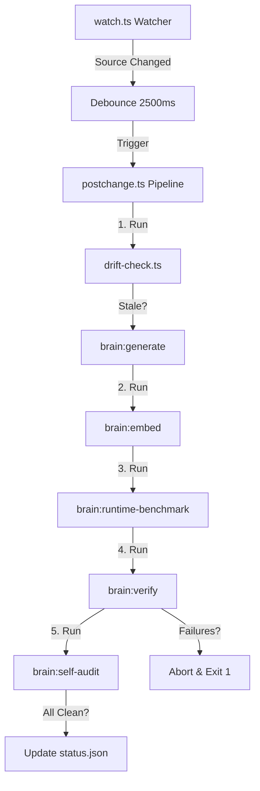

# Tutor System Architecture

This document is the human-readable architecture book for Tutor. The generated `/brain` artifacts remain the executable source of truth for graph, route, state, API, retrieval, runtime, and verification data.

## 1. Product Purpose

Tutor is an AI-powered learning interface for reading academic papers and textbooks, asking a streaming tutor questions, building a personal learning library, and reviewing knowledge over time. The product combines a PDF study surface, AI chat, voice tutoring, web search, a 3D learner brain, revision notebooks, analytics, admin diagnostics, built-in architecture/design-language library books, and the `/brain` architecture cognition layer.

The design language is **Cosmic Obsidian** for the main app: near-black surfaces (`#030303`), surfaces (`#0A0A0B`), neon violet/blue/orange accents (`#8B5CF6`, `#3B82F6`, `#F97316`), glass panels, motion-heavy transitions, and liquid AI details. Revision and Admin intentionally use a `#faf9f6` paper style to make review and diagnostics feel like a readable notebook.

---

## 2. Runtime Stack & Build Configuration

### Frontend Stack

The frontend utilizes:

- **Core**: React 19, Vite 6, TypeScript 5.8, Tailwind CSS 4.
- **State & DB**: Zustand (Global), Dexie (IndexedDB local database).
- **Visualization & Media**: Three.js, `react-force-graph-3d`, `react-pdf`, Recharts.
- **Animation**: `motion/react` (Framer Motion).
- **Markdown Parsing**: React Markdown, Remark GFM, Shiki syntax highlighter, Mermaid rendering.

### Build and Splitting Strategy (`vite.config.ts`)

To prevent heavy load times and optimize Interaction to Next Paint (INP), Vite is configured to split vendor code into dedicated bundles via `manualChunks`:

1.  **3D Graph Engine**: `Three.js` and `react-force-graph-3d` are split into a lazy chunk, loaded dynamically when the user switches to `BrainView`.
2.  **PDF Engine**: `react-pdf` and its dedicated PDF worker are isolated into a deferred worker chunk.
3.  **Parsers**: Mermaid and Shiki load on-demand only when markdown containing code blocks or diagrams is streamed.
4.  **UI Core**: Zustand, Recharts, and Lucide icons reside in the main shared client chunk.

Dynamic component imports (`React.lazy`) manage route-level code splitting. The app has no URL router. `src/App.tsx` acts as a view switcher driven entirely by `activeView` in the Zustand store.

### Backend Stack (`server.ts`)

- **Server Platform**: Express API running under Node.
- **Streams**: Server-Sent Events (SSE) for `/api/chat` model response streaming. WebSockets on `/ws/debug` for streaming diagnostics and live console logs.
- **AI Providers**: Deepgram Voice Agent API proxy, Deepgram TTS fallback, OpenAI speech fallback, Serper API for web/news searches, and OpenAI SDK broker targeting OpenRouter models.

---

## 3. Model Inventory

All cloud LLM calls are brokered by `server.ts`. The browser sends the user OpenRouter key from Settings as a bearer token, with `OPENROUTER_API_KEY`, `DEEPGRAM_API_KEY`, and `SERPER_API_KEY` as environment fallbacks.

| Use                                      | Provider                   | Model                                                                                                                        |
| ---------------------------------------- | -------------------------- | ---------------------------------------------------------------------------------------------------------------------------- |
| Default tutor chat                       | OpenRouter                 | `deepseek/deepseek-v4-flash`                                                                                                 |
| Settings chat options                    | OpenRouter                 | `anthropic/claude-3.5-sonnet`, `google/gemini-1.5-pro`, `deepseek/deepseek-v4-flash`                                         |
| Chat fallback chain                      | OpenRouter                 | `google/gemini-2.5-flash`, `anthropic/claude-3.5-haiku`, `openai/gpt-4o-mini`, `meta-llama/llama-4-maverick`                 |
| PDF title extraction                     | OpenRouter                 | `qwen/qwen2.5-vl-72b-instruct`                                                                                               |
| Persona prompt generation                | OpenRouter                 | `anthropic/claude-3.5-sonnet`                                                                                                |
| Trace explanation                        | OpenRouter                 | `deepseek/deepseek-v4-flash`                                                                                                 |
| Learning book updates                    | OpenRouter                 | `deepseek/deepseek-v4-flash`                                                                                                 |
| Flashcard extraction                     | OpenRouter                 | `deepseek/deepseek-v4-flash`                                                                                                 |
| Page vision tool                         | OpenRouter                 | `openai/gpt-4o-mini`                                                                                                         |
| Voice Agent listen                       | Deepgram                   | `flux-general-en`                                                                                                            |
| Voice Agent think                        | Deepgram/OpenAI-compatible | `gpt-4o-mini`                                                                                                                |
| Voice Agent speak                        | Deepgram                   | `aura-asteria-en`                                                                                                            |
| Read-aloud TTS                           | OpenAI, then Deepgram      | `gpt-4o-mini-tts` request mode uses OpenAI speech and falls back to `aura-asteria-en`; Deepgram Aura voices remain supported |
| Browser memory embeddings                | Local deterministic        | 384-dimensional hashed text vectors, no browser `onnxruntime-web` bundle                                                     |
| `/brain` retrieval embeddings            | Local Xenova               | MiniLM 384-dimensional chunks                                                                                                |
| Brain debug auto-fix model, when enabled | OpenAI/OpenRouter          | `BRAIN_DEBUG_MODEL`, then `BRAIN_EXECUTOR_MODEL`, then `gpt-4o-mini`/`openai/gpt-4o-mini`                                    |

`GET /api/pricing` fetches live OpenRouter pricing and caches it for six hours. Deepgram pricing constants are maintained in `server.ts`.

---

## 4. Zustand Global State Store

The global state store is defined in `src/store/index.ts` via `useStore` with Zustand's `persist` middleware. It saves user progress, API settings, and usage trackers to local storage under the key `learning-ai-store`.

Chat messages intentionally start fresh after a reload. The active `messages` array is not hydrated from Zustand persistence; completed chats are archived separately under `learning_ai_chat_archives_v1` and can be restored from the Chat Panel library context menu.

### State Properties

- **Navigation & Credentials**:
  - `activeView`: `"study" | "analytics" | "revision" | "admin"` (central application router).
  - `learnerName`: string (defaults to "Learner").
  - `apiKey` / `serperApiKey`: string (user OpenRouter and Serper keys).
- **Active Study Context**:
  - `activeLearningBookId`: string | null (persistent tracking of the active book).
  - `activeProject`: string (current learning space name).
  - `askTutorQuery`: string (search input).
  - `pdfUrl`: string | null (path of currently opened PDF).
  - `pdfScale` / `pdfPage` / `pdfTotalPages`: number.
  - `annotations`: Array of `Annotation` (strikethroughs, underlines, highlights, sticky notes).
- **Analytics Trackers**:
  - `chatUsage`: `inputTokens`, `outputTokens`, `cost`, `requests` (tracks LLM usage).
  - `voiceUsage`: `connectionSeconds`, `inputAudioSeconds`, `outputAudioSeconds`, `ttsCharacters`, `cost`, `sessions`.
  - `webUsage`: `requests`, `searchRequests`, `newsRequests`, `sourcesReviewed`, `failures`, `cost`.
  - `pricing`: `PricingState` (caches fetched OpenRouter model rates).

---

## 5. Dexie / IndexedDB Database Schema

Tutor persists concept maps, learning history, flashcards, and diagnostic trace logs in a local Dexie instance named `NeuralNestBrain` in `src/memory/longterm.memory.ts`.

### Schema Version 6

The database tables and their indexing layouts are defined exactly as follows:

- **`concepts`**: `id, name, summary, description, confidence, prerequisites, hiddenKey, childConcepts, parentConcepts, updatedAt` (concept nodes).
- **`misconceptions`**: `id, conceptId, name, description, resolved, updatedAt` (learner misunderstandings).
- **`sessions`**: `id, startedAt, endedAt, totalTokens` (active user sessions).
- **`interactions`**: `id, sessionId, timestamp, tokensUsed` (dialogue history).
- **`flashcards`**: `id, conceptId, bookId, bookTitle, front, back, nextReviewAt` (Active recall cards).
- **`traceLogs`**: `id, timestamp, action, llmExplanation` (audit trail of DeepSeek updates).
- **`learningBooks`**: `id, title, conversationCount, agentModel, overview, knowledgeSummary, chapters, updatedAt` (AI-generated textbooks).
- **`learningBookConcepts`**: `id, bookId, name, summary, confidence, childConcepts, parentConcepts, updatedAt` (concepts belonging to generated books).
- **`learningEntries`**: `id, bookId, timestamp, conversationSummary, assistantSummary` (chronological learning notes).

### MemoryOrchestrator Integration

The `MemoryOrchestrator` integrates these tables with the application runtime. When a chat session concludes:

1.  It intercepts the conversation, uses a local 384-dimensional hashed text index to locate similar historic concepts, and injects ZPD Zonal directives into the system prompt.
2.  It sends the dialogue to `/api/learning-book-update`, returning compiled summaries.
3.  It updates the matching `learningBooks`, inserts detailed notebook-style chapters, updates concepts, writes chronological `learningEntries`, and records trace logs. Earlier generated learning books are preserved across reloads while each reload starts a fresh chat session.
4.  Chat archive restore is intentionally source-scoped: selecting a previous chat clears the active PDF URL, page counters, and selected-text context before restoring messages. Static/admin books are excluded from the Chat Panel context menu, while user-generated learning books stay visible in Revision.
5.  Local fallback summaries are normalized into revision notes (`Key idea`, `Why it matters`, `How to review it`) so generic prompts such as "what is this page about?" do not become the book content. Revision also cleans legacy `Prompt:` / `Learning note:` artifacts at render time.

---

## 6. Core UI Views and Responsive Sizing Models

The application design supports fluid layout scaling across all device categories.

### Study View

- **Layout Grid**: Renders a vertical layout `flex-col` on mobile viewports to prevent squashing panels. On desktop (`xl:flex-row`), it splits into a 64% width left-hand workspace (housing the PDF viewer) and a 36% width right-hand panel (`ChatPanel`).
- **Document Ingestion**: Upload accepts PDFs and images. `/api/documents/ingest` shells to `scripts/classify_and_extract.py`, classifies native text PDFs, scanned PDFs/images, and mixed documents, then routes native/mixed text through PyMuPDF4LLM and scanned/mixed page images through bounded OCR/vision parsing. Node uses an enlarged extraction buffer because scanned pages return base64 page images before vision parsing.
- **Chat Panel**: Renders as a `<motion.aside>` that slides out or collapses using Framer Motion's `AnimatePresence`. Streaming output uses a local RAF text buffer and a non-jumping autoscroll policy so generated text appears smoothly without forcing the reasoning trace into view.
- **PDF Viewer**: Adapts using width listeners. Squeezes margins and scales canvas layouts using `ResizeObserver`. Displays a floating top-right bar for overlays (zoom, navigate, annotate) to save space.

### Revision View

- **Visual Style**: Clean paper styling (`#faf9f6`) with an overlaid noise SVG background overlay set to `opacity-[0.03]` for an organic notebook feel.
- **Sidebar Layout**: The chapter and table of contents sidebar is hidden by default and displayed only on large screens (`hidden lg:block w-64 flex-shrink-0 sticky`).
- **Mobile Navigation**: Smaller viewports replace the vertical sidebar with a top horizontal scrollbar tags navbar (`flex gap-2 overflow-x-auto pb-1`).
- **Fluid Margins**: Container uses `max-w-4xl` and shifts padding based on breakpoints (`p-5` on mobile, scaling up through `sm:p-6`, `md:p-10`, `lg:p-16`, and `xl:p-20`).
- **Built-In Books**: `RevisionView.tsx` uses a built-in book model with static architecture content from `src/lib/tutorBook.json` and an App Design Language book rendered in React. The design-language book contains a cleaned wireframe map, theme tokens, and interactive UI component previews; it preserves the existing long-press hide/delete behavior through per-book local storage keys.

### Brain View

- **3D Workspace**: Three.js/WebGL canvas managed by a custom `ResizeObserver` listener on the parent container. Automatically re-centers coordinates when the window resizes to prevent graph drift.
- **Sidebar Details Card**: An overlay card positioned absolutely. Occupies full width (`left-5 right-5`) on mobile/tablet screens and transitions to a fixed width of `720px` (`xl:right-auto xl:w-[720px]`) on desktop viewports.

### Admin View

- **Layout**: Matches the `#faf9f6` paper layout of the Revision View, sharing the identical responsive sidebar navigation (`hidden lg:block`) and mobile top header (`lg:hidden`).
- **Monospace Console**: Renders a hardware-accelerated monospace log viewport. Uses a `useEffect` layout trigger to automatically scroll the console to the bottom on new incoming WebSocket trace logs.
- **Debug Ledger**: Displays active and historic `DebugRuns`. Component card sub-logs are collapsed by default to allow fast scrolling and high readability on small viewports.
- **Run Visibility**: The server summarizes both `summary.json` and `run.json`, marks stale externally-killed runs as `interrupted`, and supports `scan`, `audit`, and `fix` modes from Admin so long-running all-scope audits remain visible immediately.

---

## 7. High-Fidelity Animations

Tutor features advanced UI motion choreography using hardware-accelerated web techniques.

### Siri Liquid Glass Orb Shader (`SiriLiquidGlass.tsx`)

This component creates an organic liquid glass fluid overlay resembling Apple iOS voice systems without the performance cost of compiling raw WebGL fragment shaders.

- **Layout**: Outer wrapper uses `absolute inset-0 overflow-hidden mix-blend-screen blur-[4px]` overlays on dark backgrounds.
- **Parent Wrapper**: A large container `absolute w-[200%] h-[200%] top-[-50%] left-[-50%]` that undergoes continuous rotation, accelerating from a passive rate (`duration: 10`) to an active rate (`duration: 3`) during voice activation.
- **Independent Color Orbs**: Inside the parent container, four colored circles float and pulse independently using spring animations:
  1.  **Blue Orb** (`#0a84ff`): Scales to `1.3` on hover; floats on X and Y paths during active voice streams.
  2.  **Purple Orb** (`#bf5af2`): Scales to `1.2` on hover; moves along X coordinates.
  3.  **Orange/Pink Orb** (`#ff375f`): Scales to `1.4` on hover; shifts along Y coordinates.
  4.  **Cyan/Teal Core** (`#64d2ff`): Keyframe-pulses passively to act as a high-contrast core.
- **Color Bleeding**: Utilizing `mix-blend-screen` within the outer wrapper creates organic plasma-like color bleeding.

### Reasoning Thinking Panel (`ChatPanel.tsx`)

Renders an o1-style streaming thinking trace for complex reasoning loops.

- **Step Categorization**: Tracks active phases (`retrieving`, `web_search`, `tool_execution`, `synthesizing`, `complete`). Uses `thoughtStepMeta` to dynamically assign theme values based on text contents (Search: `#0A7DFF`, Vision: `#6929F4`, Tool: `#36AA55`, Graph: `#D87A2C`, Recall: `#D49B23`, Synthesis: `#6929F4`, Reasoning: `#6A6A6A`).
- **Source-Material-First Search Policy**: Questions about the current page, screen, selected text, uploaded document, active book, visible diagram, or "what is this about" are answered from local source context and the page-vision tool. Serper web search is gated to explicit web/internet requests or truly freshness-sensitive external facts.
- **Timeline Animations**: Sequenced using index-based delays (`index * 0.48s`).
  - `reasoningStepVariants`: Fades in and slides up steps.
  - `reasoningIconVariants`: Scale, rotate, and bounce spring sequence (`scale: 0.34` to `0.6`, `rotate: [-14, 9, -3, 0]`).
  - `reasoningLineVariants`: Separator vertical lines expand downward (`scaleY` from `0` to `1`) _after_ icons land.
- **Gradient Shimmer Mask**: Text uses a hardware-accelerated linear gradient mask:
  ```css
  background-image: linear-gradient(
    100deg,
    #52525b 0%,
    #52525b 34%,
    #111827 45%,
    #a1a1aa 52%,
    #52525b 66%,
    #52525b 100%
  );
  background-size: 240% 100%;
  ```
  Shifts the `backgroundPosition` across coordinates to create a typing shimmer. Animates with GPU acceleration via `willChange` to avoid Interaction to Next Paint (INP) frame lag during streaming.

---

## 8. Performance Optimizations

### INP Mitigation via `useMotionValue`

Binding standard window or container scroll listeners to React state variables (`useState`) triggers component-wide re-renders on every scroll tick. In complex layouts like the PDF Study View, this degrades Interaction to Next Paint (INP) frames.

- To resolve this, `StudyView.tsx` binds scroll progress directly to Framer Motion values:
  ```typescript
  const { scrollYProgress } = useScroll({ container: scrollContainerRef });
  const arrow1Opacity = useTransform(scrollYProgress, [0.3, 0.45], [0.9, 0]);
  ```
- Updates update the DOM directly, bypassing the React virtual DOM render thread to maintain a constant 60+ FPS.

### Ticker Counter Hook (`useAnimatedNumber`)

Renders high-speed rolling numerical values (tokens, cost, characters) without layout stutter:

- Takes a `target` number and computes differences from the previous state via `displayedRef.current`.
- Updates numbers using a cubic ease-out curve (`1 - Math.pow(1 - progress, 3)`).
- Runs inside `requestAnimationFrame` loops, canceling older frames on component unmount to prevent render jitter.

---

## 9. `/brain` Cognitive Autonomy Layer

The `/brain` folder contains an executable cognitive layer. It monitors the codebase, generates vector search indexes, maps dependencies, and manages self-healing debugging loops.



### Self-Healing Autonomy Subsystems

1.  **Workspace Watcher (`brain/autonomy/watch.ts`)**: Monitors folders via `fs.watch`, debounces changes (2500ms), and spawns the postchange pipeline. Writes watch statuses to `status.json`.
2.  **Drift Check (`brain/drift-check.ts`)**: Compares SHA-256 hashes of all source code files against snapshots in `file-hashes.json`. Outputs `regenerationTargets` based on modified files:
    - `src/store/` -> `state-flow`
    - `server.ts` -> `api-contracts`
    - `src/App.tsx` -> `route-map`
    - `src/components/` or `src/views/` -> `render-graph`
    - `src/memory/` -> `database-impact`
3.  **Artifact Generator (`generate-brain.ts`)**: Rebuilds semantic dependency maps, API contract definitions, and layout hierarchies.
4.  **Vector Indexer (`brain/embed`)**: Chunks codebase contexts locally via Hugging Face `Xenova/all-MiniLM-L6-v2` transformer pipelines. Saves 384-dimensional text vectors into a local database.
5.  **Telemetry Benchmark (`brain/runtime-benchmark`)**: Captures rerender performance, memory usage, and state propagation hotspots.
6.  **Invariants Verification (`brain/verify`)**: Validates route configurations, store state shapes, API signatures, and runs test suites.
7.  **Self-Audit (`brain/self-audit.ts`)**: Examines cognitive maturity and generates an audit report from the latest generated source graph, retrieval index, runtime traces, and rule checks.

---

## 10. Debug Skill & Long-Horizon Orchestrator

The autonomous debugging utility operates independently of default tutor dialogues, executing multi-step repair loops.

### Invoking the Tool

```bash
npm run brain:debug -- --mode fix --scope changed
```

### Execution Protocol

The orchestrator starts from the narrowest truthful scope: `changed`, a named component, route, or file. `--scope all` is reserved for explicit full-system audits and sorts UI routes/components before `/brain` tooling. Every target follows a tightened 35-step process:

The tutor-debug skill defines three operating modes:

- **Focused Fix Mode**: a named bug, file, component, or route.
- **Changed-Work Audit Mode**: the current changed source surface after normal implementation.
- **Long-Horizon Task Mode**: an explicit complete audit that forces `scope=all`, walks every source-scoped target, runs all 35 steps per target, and applies guarded deterministic fixes whenever the safety gate passes.

Long-Horizon Task Mode is invoked with:

```bash
npm run brain:debug -- --mode long-horizon --scope all
```

1.  **Parse architecture**: Scans targets.
2.  **Understand purpose**: Analyzes product role.
3.  **Lock scope**: Prevents accidental all-repo expansion.
4.  **Analyze dependencies**: Maps imports, downstream consumers, and runtime edges.
5.  **Verify mutation boundary**: Checks high-risk contracts before edits.
6.  **Detect anti-patterns**: Reviews syntax and architecture patterns.
7.  **Detect performance issues**: Measures runtime and render risk.
8.  **Detect stale state**: Checks stale dependencies and outdated assumptions.
9.  **Detect render problems**: Audits UI components for visible defects.
10. **Detect memory leaks**: Checks cleanup and listener lifetimes.
11. **Detect async issues**: Inspects unresolved promises and race conditions.
12. **Detect typing issues**: Checks TypeScript contracts.
13. **Detect animation issues**: Validates motion and frame risk.
14. **Detect API issues**: Checks server/SSE/WebSocket compliance.
15. **Detect accessibility issues**: Reviews semantic HTML and WCAG contrast.
16. **Detect responsive layout and overlap issues**: Checks mobile, notebook, and desktop widths for collisions, clipping, and cramped controls.
17. **Detect source-material boundaries**: Ensures chat/vision/retrieval/web-search tools do not bypass local study context.
18. **Detect model/config drift**: Compares configured defaults against current provider docs and local settings.
19. **Detect document-ingestion branch coverage**: Verifies native, scanned/image, and mixed document paths.
20. **Verify live surface**: Proves UI work renders as a live interactive surface, not a static mock.
21. **Execute browser**: Runs the app through `/browser` when available or the Playwright-backed probe as a recorded fallback.
22. **Test viewports**: Checks mobile, tablet, and desktop dimensions for overflow and blank states.
23. **Simulate interactions**: Clicks, toggles, navigates, scrolls, and types where the target owns an input path.
24. **Instrument runtime**: Captures console/page errors, frame timing, responsiveness, and route/runtime signals.
25. **Check visual regression**: Records screenshot hashes, screenshot size, nonblank viewport evidence, overflow, and overlap signals.
26. **Test state transitions**: Exercises route, toggle, loading, empty, disabled, error, and persisted-state transitions when owned by the target.
27. **Verify interactive states**: Checks keyboard reachability, loading, empty, error, disabled, toggled, and paged states.
28. **Compare best practices**: Compares code against local and official references.
29. **Search documentation patterns**: Maps evidence for implementation choices.
30. **Generate improvements**: Designs concrete repair options.
31. **Gate patch safety**: Blocks broad or unrelated patches.
32. **Apply guarded patches**: Applies source-hash-checked fixes only when justified.
33. **Run focused validation**: Runs targeted format/type/build checks.
34. **Run targeted regressions**: Runs responsiveness probes, animation sampling, runtime/UI checks, and after benchmarks.
35. **Persist findings**: Saves summaries, run artifacts, and memory graph updates into `/brain`.

The regression stage runs `brain:ui-regression`, a Playwright probe checking actual browser execution, mobile/tablet/desktop layouts, interaction simulation, state transitions, sampled frame smoothness, console/page errors, screenshot hashes, opaque headers, reasoning-dropdown states, and interactive Revision design-language previews.

---

## 11. Maintenance Boundaries

High-risk mutation boundaries remain Dexie schema, server API/SSE/WebSocket contracts, Zustand store shape, routing, shared layout primitives, ChatPanel stream parsing, and generated `/brain` artifacts.

Generated graph, flow, contract, vector, impact, runtime, snapshot, and verification outputs must be regenerated by commands rather than manually edited.

Before reporting architecture work done, run:

```bash
npm run brain:generate
npm run brain:embed
npm run brain:runtime-benchmark
npm run brain:verify
npm run brain:drift-check
npm run brain:self-audit
npm run format:check
npm run lint
npm run build
```
