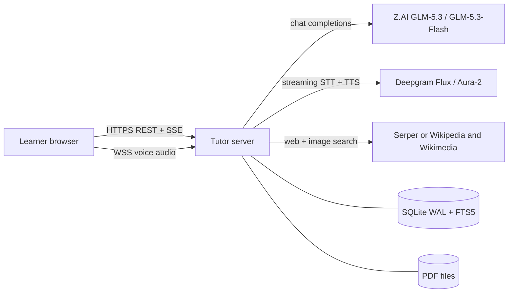
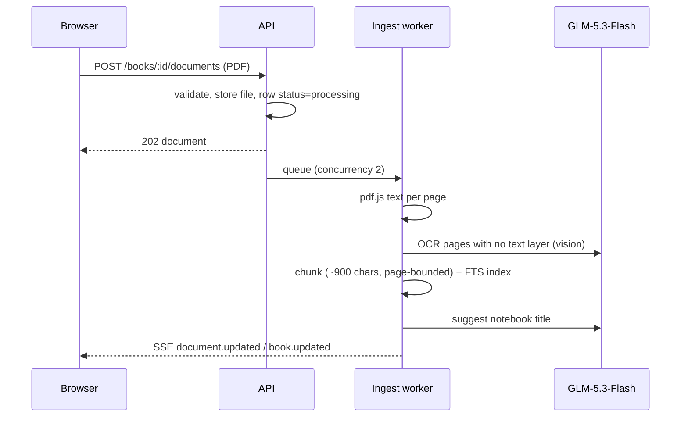
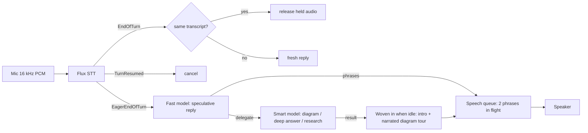
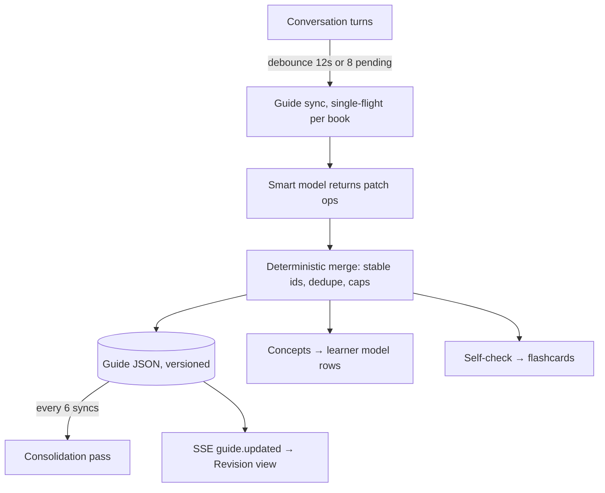
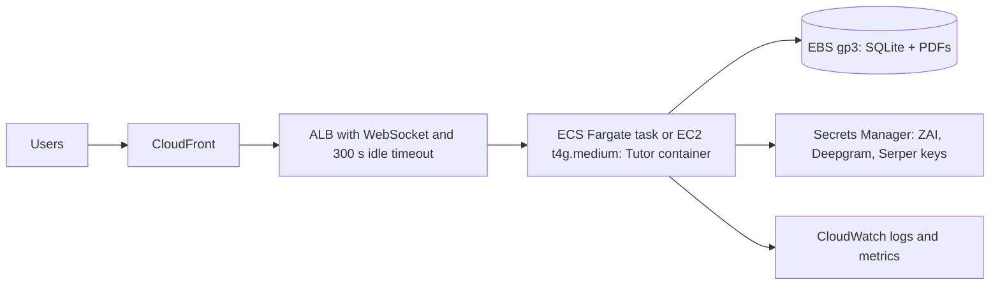

# Tutor — System Architecture (v2)

Tutor is a study workspace: a learner brings their own documents, asks questions
by typing or talking, and the system teaches from those documents, checks
understanding, and keeps a living visual study guide up to date in the
background.

This document explains how v2 is built, why, and how it scales.

---

## 1. Design principles

1. **One source of truth.** The server owns all learner data (SQLite today,
   Postgres later). The browser keeps only preferences. v1 had three
   overlapping stores (Dexie, per-user SQLite, localStorage) plus a migration
   layer; v2 has one.
2. **Fast talker, slow thinker.** Anything a human is waiting on runs on the
   fast model with a small context. Anything deep runs on the smart model in
   the background and is woven back into the conversation when ready.
3. **Every model call goes through a priority queue.** Live voice turns beat
   typed chat, which beats background work, which beats housekeeping. Upstream
   throttling shrinks concurrency automatically (AIMD).
4. **Grounded, then adaptive.** Answers cite pages from the learner's own
   documents. Mastery moves only on graded evidence (quiz answers and
   flashcard reviews), never because a model said so.
5. **Lightweight to run.** One Node process serves the SPA, the REST/SSE API
   and the voice WebSocket. There is no Python, no separate voice server and
   no required cache or queue service. Offline mock providers make the whole
   system runnable and testable without API keys.

---

## 2. System context



| Concern | Choice | Why |
| --- | --- | --- |
| Fast model | `glm-5.3-flash` (reasoning effort `low`) | Low time-to-first-token for voice and chat; natively multimodal, so it also does OCR |
| Smart model | `glm-5.3` | Background delegation, study-guide synthesis, "deep" chat mode |
| STT | Deepgram Flux (`flux-general-en`), Nova-3 for other languages | Native turn detection with **EagerEndOfTurn**, so replies can start speculatively |
| TTS | Deepgram Aura-2, one request per phrase | Low time to first audio; exact per-phrase boundaries for captions, diagram-tour sync and barge-in truncation |
| Retrieval | SQLite FTS5 BM25 (porter + trigram for CJK) | Sub-millisecond, free, deterministic; no vector DB to operate |
| Search | Serper (web + `/images`) → Wikipedia / Wikimedia Commons fallback | Cheapest Google-quality results; free, openly licensed fallback when no key is set |

All providers sit behind interfaces (`LlmProvider`, `SpeechProvider`,
`Search`), so switching vendor means changing one adapter.

---

## 3. Code layout

```
shared/            wire contracts used by server and web (types, voice protocol,
                   study-guide schema, speech normalisation)
server/
  index.ts         process entry: HTTP + WebSocket + graceful shutdown
  app.ts           Express app: security headers, CORS, API, static/Vite
  config.ts        every environment variable, parsed once
  context.ts       composition root (providers → services → gateway)
  lib/             limiter (priority + AIMD), SSE, events hub, metrics, log
  providers/       zai.ts (GLM), deepgram.ts, search.ts, mock.ts, llm.ts
  store/           SQLite schema + repositories (library, messages,
                   retrieval, guides, learning, activity, files)
  services/        ingest, pdf, context, prompts, tools, tutor, guide,
                   learning
  voice/           gateway (tickets + upgrade), session (duplex engine),
                   speech-queue
  http/            routes, middleware
web/src/
  app/             shell, navigation, settings
  features/study   intro, PDF reader, chat panel
  features/voice   voice overlay, session hook, visual stage
  features/revision library, study-guide renderer, concept map, review
  features/analytics dashboard
  components/      UI primitives, Markdown, Diagram, PatternCard
  lib/             api, queries, events, audio, speaker, mermaid
```

No backend file is over about 600 lines. v1's `server.ts` was 6,600 lines, and
`ChatPanel.tsx` and `AdminView.tsx` were more than 9,000 lines each.

---

## 4. Key flows

### 4.1 Document ingestion



### 4.2 Typed chat turn

1. `buildContext` assembles the book, the documents, the **open page**, the
   highlighted passage, the top BM25 passages and the learner model (weak and
   strong concepts), within a character budget.
2. The fast model streams the reply over SSE (`start → reasoning → delta →
   part → done`). Tool rounds run **in parallel**, with a maximum of 3.
   - `search_document`, `web_search`, `show_images`, `create_quiz`, `make_flashcards`
   - Diagrams are inline Mermaid blocks. The client draws them in and can
     narrate them node by node ("Walk me through").
3. Citations like `[D1 p.12]` are resolved to real pages and become clickable
   chips that jump the reader.
4. If the client disconnects, the model stream is aborted and the partial
   answer is saved as `interrupted`.
5. The turn triggers a debounced study-guide sync.

### 4.3 Voice: duplex "fast talker, slow thinker"



- **Latency budget.** STT end of turn takes about 260 ms (Flux p50). An eager
  start saves 150–250 ms more. Then come the fast-model first token and first
  TTS audio (about 200 ms). A phrase chunker releases the first clause as soon
  as it has about 12 characters.
- **Barge-in is two-stage.** `StartOfTurn` while the tutor talks only *ducks*
  playback, because it may be echo. Two real words, or an end of turn,
  *clears* playback. The assistant message is then truncated to the
  segments the learner actually heard, as reported by the client's playback
  events.
- **Speech hygiene.** The voice prompt forbids markdown and code. A
  deterministic normaliser (`shared/speech.ts`) handles anything that slips
  through:
  - code and diagram blocks become one spoken pointer
  - LaTeX is read in words
  - URLs become domains
  - citations are dropped
- **Visual channel.** Background results arrive as `visual` messages
  (diagram, images, markdown). Narrated diagram steps are TTS segments with a
  `focus` node, so the node highlight is in sync with the audio.
- **Fallbacks.** Without Deepgram, the same session runs with browser speech
  recognition and synthesis. The server duplex brain is unchanged.

### 4.4 Living study guide



- The model sees only a **compact guide plus the unseen messages**, so prompt
  size stays flat as the guide grows.
- Operations: `set_overview`, `upsert_section`, `add_concepts`,
  `add_glossary`, `add_misconceptions`, `set_next_steps`.
- The merge is pure and unit-tested:
  - title similarity matching prevents near-duplicate sections
  - key points, callouts and self-checks are de-duplicated and capped
  - a consolidation that loses more than 60 % of the sections is rejected

### 4.5 Adaptive learning

- **Mastery** per concept uses Bayesian Knowledge Tracing (slip 0.1, transit
  0.12, guess from the question format).
- **Evidence** comes from chat quiz cards (graded server-side; the answer
  never reaches the client before submission) and flashcard reviews.
- **Scheduling:** SM-2 with a 10-minute relearning step on lapses.
- **Adaptation:** every context packet carries the learner level and shaky
  concepts. The prompt shifts between intuition-first, scaffolded and
  concise-and-deeper styles, and poses check questions.

---

## 5. Model access: concurrency, queueing and failure handling

- **One `PriorityLimiter` per model role** (`fast`, `smart`, `vision`). Waiters
  are ordered by priority (`realtime` < `interactive` < `background` <
  `batch`), FIFO within a priority, and are cancellable while queued.
- **AIMD.** A 429 or Z.AI code 1302 halves effective concurrency. Each
  success adds one back.
- **Retry policy by priority.** Interactive work gets at most 2 quick retries
  (≤ 2.5 s). Background work retries longer (up to 45 s backoff). Quota errors
  (1113, 1308, 1310) are never retried; they are shown to the learner with the
  reset time when Z.AI provides it.
- **GLM-5.3 always reasons.** `thinking: disabled` returns error 1210, so the
  client sends `reasoning_effort: low` for latency-sensitive calls. It also
  learns per model at runtime which models reject disabled thinking.
- Defaults are fast = 3 and smart = 2 concurrent requests. Tune them with
  `ZAI_*_CONCURRENCY` to match the account tier.

> **Z.AI plan note.** The GLM Coding Plan endpoint
> (`/api/coding/paas/v4`) only accepts Coding Plan keys. Z.AI's terms restrict
> those keys to supported coding tools, so production should use a
> pay-as-you-go key on `/api/paas/v4` (the default here).

---

## 6. Data model (SQLite, WAL)

| Table | Purpose |
| --- | --- |
| `users` | local learner profiles |
| `books` | notebooks (title auto-suggested until the learner renames) |
| `documents`, `pages` | PDFs and per-page text |
| `chunks`, `chunks_fts`, `chunks_tri` | retrieval index (porter and trigram FTS5, synced by triggers) |
| `messages` | one thread per book; `channel` = chat or voice; `parts_json` holds sources, images, diagrams, quizzes |
| `guides` | versioned study-guide JSON + `covered_seq` cursor |
| `concepts`, `attempts`, `quizzes`, `cards` | learner model, evidence, spaced repetition |
| `annotations` | PDF highlights and notes |
| `activity`, `llm_usage` | analytics and per-learner token accounting |

Every row carries `user_id`, so the schema maps directly onto Postgres with
row-level ownership.

---

## 7. Security

- **Identity.** Each browser gets a local learner profile ID, sent as
  `X-User-Id`. An optional `ACCESS_CODE` protects a deployment. For
  production, put OIDC in front (Cognito or Auth0) and map the verified
  subject to the learner ID. Routes already scope every query by `userId`.
- **Voice.** Browsers can't set WebSocket headers, so the client gets a
  **single-use, 60-second ticket** over authenticated HTTP. The WebSocket
  upgrade also checks the origin against the app host and `ALLOWED_ORIGINS`.
- **Rate limiting.** Model-backed routes have a per-learner token bucket
  (`USER_REQUESTS_PER_MINUTE`).
- **Uploads.** PDF only, magic bytes checked, size-limited, stored under
  opaque IDs.
- **Secrets.** Provider keys live only on the server. The logger redacts
  anything that looks like a credential.

---

## 8. Deployment on AWS

### Phase 1: single instance (up to about 1–2k concurrent learners)



- The multi-stage `Dockerfile` builds the SPA and server bundle and runs as
  non-root with a `/api/health` check.
- The server handles `SIGTERM` by draining voice sessions, so rolling deploys
  don't cut learners off mid-sentence.
- Cost is roughly $40–70 a month in infrastructure. Model, STT and TTS usage
  dominates spend.

### Phase 2: horizontal scale (10k+ concurrent)

| Swap | For | Effort |
| --- | --- | --- |
| SQLite | **RDS Postgres** (FTS via `tsvector` + `pg_trgm`, or `pgvector` for dense retrieval) | repository layer only |
| Local PDF files | **S3** (`FileStore` interface) | one adapter |
| In-process `EventHub` | **ElastiCache Redis** pub/sub | one class |
| In-process ingest and guide queues | **SQS** + worker service | job handlers unchanged |

- Voice sessions are stateful per WebSocket. The ALB needs no stickiness
  because a session never outlives its connection.
- Autoscale on active voice sessions and event-loop lag.

### Alternatives considered

- **OpenAI Realtime / GPT-Live** (speech-to-speech). Lower engineering effort
  and true duplex, but it locks the brain to OpenAI and costs about
  $0.05–0.30 per minute. The cascade keeps GLM as the brain and per-minute
  cost at about $0.03–0.05 (STT + TTS) plus tokens.
- **Vector database** (Pinecone, OpenSearch). Not needed at notebook scale;
  BM25 over page-bounded chunks already grounds answers well. `pgvector` is
  the natural next step.
- **Vercel / serverless.** No long-lived WebSockets, which duplex voice needs.
  The SPA can still be served from a CDN with `VITE_API_BASE` pointing to the
  API.

---

## 9. Observability

- Structured JSON logs in production.
- `GET /api/system` reports limiter queue depth and throttling per model,
  LLM p50/p95 latency and time to first token by purpose, voice
  end-of-turn-to-first-audio p50/p95, the speculation hit rate and barge-in
  counts.
- Per-learner token usage (`llm_usage`) supports cost attribution.

---

## 10. Local development

```bash
cp .env.example .env    # add ZAI_API_KEY (and optionally DEEPGRAM / SERPER)
npm install
npm run dev             # http://localhost:3000 — API, SPA (Vite HMR), voice WS
npm test                # unit + integration (mock providers, no network)
npm run build && npm start
```

Without keys, the server uses the offline mock model and browser speech, so
every screen and flow still works for development.
