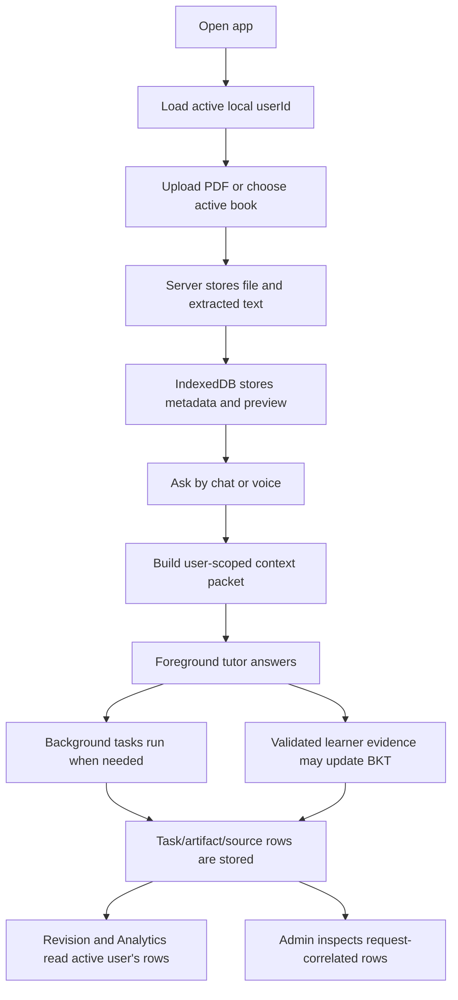

# Learner Brain Architecture

Date: 2026-06-10

This document explains the current learner-brain architecture in plain language.
It is separate from Graphify, which is the repository architecture graph for
developers and agents.

## Two Brains

Tutor has two different "brains":

| Brain         | Purpose                                                                                           | Stored where                              |
| ------------- | ------------------------------------------------------------------------------------------------- | ----------------------------------------- |
| Repo brain    | Helps developers and agents understand the codebase.                                              | `graphify-out/`                           |
| Learner brain | Stores one learner's study memory, PDFs, concepts, evidence, mastery, artifacts, and corrections. | `data/users/<userId>/` plus browser cache |

Graphify must not be mixed with learner data. Graphify describes source code.
The learner brain describes a user's study state.

## Identity

The app currently uses local profiles, not cloud login. On startup, the browser
creates or loads an `activeUserId`. Requests send that user ID in
`X-LearningAI-User-Id`, and voice sessions include it in websocket auth.

This gives the local app a stable ownership key:

- each learner can have separate books and PDFs;
- chat and voice context is assembled for the active user;
- BKT evidence and mastery deltas are written for the active user;
- Admin can inspect which local learner a row belongs to.

Local profile IDs are not production authentication. Cloud auth, tenant
policies, backups, and organization administration remain future work.

## Storage Boundary

Durable learner data is now server-owned:

```text
data/users/<userId>/
  brain.sqlite
  documents/
  extracted-text/
  artifacts/
  exports/
```

SQLite is a small database stored as a server-side file. It is the local bridge
to a future cloud database.

IndexedDB is browser storage. Dexie is the library Tutor uses to query it. In
the current architecture, IndexedDB is cache and UI state:

- good for metadata, previews, selected document/page state, and offline
  fallback rows;
- not the durable owner for full PDF blobs or full extracted PDF text.

Existing IndexedDB data is migrated non-destructively. Legacy document blobs are
backfilled to the server store when possible, and browser rows are converted to
server-backed metadata.

## Main User Flow



## Context Packet

Chat and voice now use the same context builder. The packet can include:

- active `userId`;
- request/proof IDs for Admin correlation;
- active book and active document IDs;
- active PDF manifest;
- full server-extracted text when available;
- selected text and current interaction state;
- semantic memory from previous relevant discussions;
- learner model/BKT state;
- pending background work.

Voice gives priority to active book/PDF context so the live tutor stays grounded
in what the learner is looking at. Chat can carry richer context when budget
allows.

## Background Tasks

The foreground tutor should answer immediately. Slow work is represented as a
background task:

- web/current information lookup;
- PDF/document tool work;
- generated artifacts;
- code or analysis jobs;
- voice broker background work;
- typed-chat request lifecycle rows.

Task rows are request-correlated. That means Admin can follow one user action
across chat, voice, retrieval, tools, model runs, artifacts, and memory writes.

## Evidence And BKT

BKT means Bayesian Knowledge Tracing. Tutor uses it to estimate whether a
learner knows a concept based on validated attempts.

Important rule:

> Conversation alone does not update mastery.

The following can help teaching but stay audit-only:

- model summaries;
- voice transcripts;
- web/tool results;
- generated notes;
- misconception candidates;
- source cards;
- artifacts.

The following can update mastery only when linked to a real concept and outcome:

- evaluated answers;
- flashcard reviews.

Accepted evidence writes a verified evidence event and a mastery delta for the
active user. Duplicate attempts are idempotent, and broken audit links block
readiness claims.

## What Is Still Local-Beta

- Local profile IDs are not cloud auth.
- SQLite and local folders are not cloud backup.
- IndexedDB migration is non-destructive, but old unscoped rows may still exist
  as legacy fallback until migrated.
- Real provider latency and voice quality still need measured proof for each
  provider/region/hardware path.
- Artifact provenance proves where a record came from; it does not prove every
  generated sentence is factually true.
